# When the Orchestrator Isn't Code

*A treatise on agents that act*

> This is the combined edition. It keeps the rhythmic spine — short numbered
> beats, an argument built one stroke at a time — folds back the longer prose
> where the long prose said it better, and then extends both with the working
> code the argument was pointing at all along: the bug in each of the six
> agent classes, the six primitives of the ceiling, the whole agent loop
> made durable end to end, and — last — an honest accounting of what it is
> still glossing over. Every figure appears twice: once as a diagram, once
> as a plain-text plate, so the argument survives whether you are reading the
> rendered page or the raw source. The small monospace couplets set between
> paragraphs are sentence-breakers; read them as breath marks.

---

## Prelude

1/ A wrong sentence is forgiven. A wrong charge is disputed. A wrong message — sent under your name, to your customer, on your authority — is apologised for, sometimes for years. The cost of being wrong about words and the cost of being wrong about acts are not on the same scale. The systems that produce them must not be either.

2/ A chatbot produces words. An agent produces acts. The chatbot's failures stay inside the conversation. The agent's failures leak into the world.

3/ This is not a degree of difference. It is a difference of kind. A model that places trades, sends messages, books trips, files tickets, signs documents — that model is not a chatbot with extra steps. It is a different category of system, and the category has its own engineering.

4/ Most current agent frameworks have not yet admitted this. They treat the agent as a chatbot with hands. Tools are added. Retries are wrapped. State is checkpointed. The pattern of the chatbot is preserved while the consequences underneath it have changed. The retry decorator is the tell.

5/ Every retry decorator is a place where the framework asked the developer to solve, by hand, what ledgers and merchants and clearing houses solved at the boundary a long time ago. Multiplied across every tool call, the developer rebuilds — badly — the workflow runtime they did not realise they needed.

6/ The reasonable objection. Merchants already keep books. Stripe deduplicates. Shopify holds carts. Brokers accept idempotency keys. Why does the agent need to keep books above the merchant?

7/ Because each merchant keeps the half of the ledger that protects the merchant. None keeps the half that protects the agent. After a restart, an agent without its own books cannot tell whether the call was made and the response was lost, or never made at all. Two systems, both correct, neither wrong, and reality somewhere between them until someone reconciles.

```text
merchant ledger ≠ agent ledger
```

8/ This is the floor. It is well-trodden. Lamport in 1978: there is no global clock. Garcia-Molina and Salem in 1987: maintain consistency through compensation. Helland later: distributed systems live on grants, agreements, and apologies. Forty years of literature has been telling agent builders what they are about to discover.

9/ The ceiling is new. The forward path of an LLM-orchestrated agent is not a graph an engineer can enumerate at design time. The compensation depends on what the model decided. The action space is open. The audit, when it comes — and it will come — must include reasoning, not effects alone. The journal stops being a record of *what* happened. It becomes the record of *why*.

10/ Frameworks have noticed. Temporal, Restate, DBOS, Step Functions, Cloudflare Workflows. The runtime layer is being built. The agent framework layer is, increasingly, an application of it.

11/ The deflationary argument — *we already have sagas* — is correct about the floor and silent about the ceiling. The expansive argument — *agents need everything new* — is wrong about the floor and right about the ceiling. The conversation goes in circles because the language has not separated the two.

12/ The chatbot was forgiven for forgetting. The agent will not be. An agent is a contract with the world. The runtime is what keeps the contract honest.

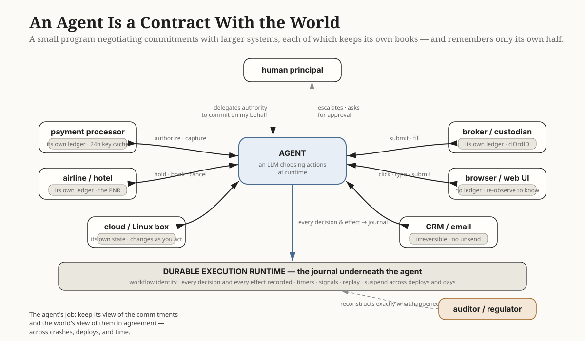

```text
                          human principal
                       (delegates · approves · escalates)
                                   │
                                   ▼
   payment ─┐                  ┌───────┐                  ┌─ broker / custodian
   airline ─┼─ commitments ───►│ AGENT │◄─── commitments ─┼─ browser (no ledger)
   cloud ───┘                  └───┬───┘                  └─ CRM / email (no unsend)
   each keeps its own                  │ every decision & effect
   half of the ledger                  ▼
   ════════════════════════════════════════════════════════════════════════
    DURABLE EXECUTION RUNTIME — the journal underneath
   ════════════════════════════════════════════════════════════════════════
                                       │  reconstructs what happened
                                       ▼
                              auditor / regulator
```

*The agent is a small program negotiating commitments with larger systems, each of which keeps its own books — and remembers only its own half. Its job: keep its view of the commitments and the world's view of them in agreement, across crashes, deploys, and time.*

---

## I. The Asymmetry

1/ An agent is a chatbot that can spend your money. That is the whole story and the whole problem.

2/ The chatbot's worst day is a wrong answer. The agent's worst day is the wrong charge. The first is fixed by clicking *regenerate*. The second is not.

```text
words fail in the transcript
acts fail in the ledger
```

3/ Look at it from the system's side, not the user's. A chatbot returns text. The text is consumed by the user, who decides whether to act on it. The user is the integration point. The user catches errors. The user reconciles. The user is, in the language of distributed systems, the end-to-end check.

4/ An agent removes the user from that role. The agent is the integration point. The agent catches errors. The agent reconciles. The agent is the end-to-end check. The user has delegated the role and gone to bed.

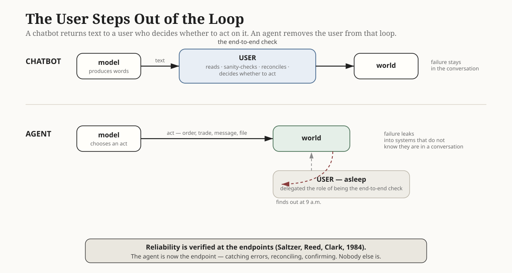

```text
CHATBOT     model ──► [text] ──►  USER  ──► world
                                  (reads · reconciles · decides whether to act)
                                  = the end-to-end check       failure stays in the conversation

AGENT       model ──► [act] ──────────────────► world
                                                              failure leaks into systems
            USER (asleep — delegated the role) ┄┄┄┄┄┄┄┄┄┄┄┄┄┄ that don't know they're in a
                                                              conversation — "finds out at 9 a.m."
```

*A chatbot returns text to a user who decides whether to act on it — the user is the end-to-end check. An agent removes the user from that loop and inherits the role: catching errors, reconciling, confirming. Nobody else is doing it.*

5/ This is the move. The user has handed the agent authority to commit on their behalf. *Commit* is not a metaphor. It is the database word. It is the point at which a change becomes durable, becomes other people's truth, becomes something that can no longer be unsaid by deciding not to mean it.

6/ The chatbot does not commit. The chatbot proposes. The agent commits.

7/ A system that proposes is graded on the proposal. A system that commits is graded on whether the commitment was correct, whether it was authorised, whether it was honoured by the counterparty, whether the counterparty's record agrees with the agent's record, and whether anyone, asked, can reconstruct what happened. It is graded, in the end, on whether reality — after the run — looks the way the user wanted. The transcript can be regenerated. Reality cannot.

8/ Five graders, not one. None of them are reading the prose.

9/ This is why the discipline becomes less a 2020s machine-learning problem than a 1990s distributed-systems problem with a stochastic step in the middle. The hard part is not the model. The hard part is the part of the system that must keep promises across crashes, deploys, network partitions, and the model's own caprice.

10/ The model has been improving for ten years. The system around it has not. Every benchmark gain in reasoning, every new tool-use capability, every longer context window is a benchmark gain at the front of the contract. The back of the contract has not moved.

11/ The chatbot was forgiven for forgetting. The agent will not be.

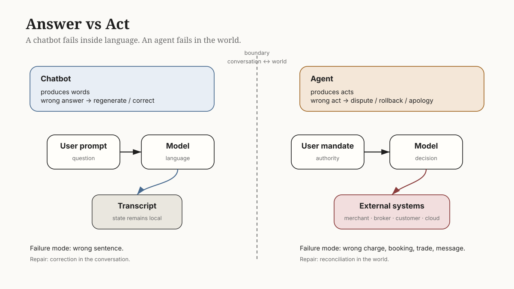

```text
CHATBOT                                      AGENT
-------                                      -----
user asks                                    user delegates
   │                                            │
   ▼                                            ▼
model produces words                         model chooses act
   │                                            │
   ▼                                            ▼
transcript changes                           world changes
   │                                            │
wrong sentence                                wrong charge / trade / message
   │                                            │
fix: correct / regenerate                     fix: reconcile / compensate / apologize
```

*The chatbot's failure remains in language. The agent's failure crosses into systems that do not know they are inside a conversation.*

---

## II. Three Commitments

Three concrete cases. The first two as prose, briefly, to establish the shape. The third in detail — diagrams, code, and the ceremony the developer ends up writing — because the third is where the argument stops being an argument and becomes a bill of work.

Read each as a sequence of mutations against the world, not as a happy-path API call.

### The shopping agent

1/ A user says: *find me these running shoes in size 11, ship to my home*.

2/ The request resolves into four commitments across three systems. The cart held at the retailer. The payment authorised on the card. The order committed at the retailer. Inventory decremented in a real warehouse three states away.

3/ Four promises. Three vendors. None of them know about each other.

4/ The agent's process dies between the second commitment and the third. The card has a hold. The order does not exist. The user does not know.

5/ Without durable execution, the agent on retry runs from the top. Searches again. Picks again. Attempts checkout again. Whether duplicates fire at the retailer or at the card depends on whose idempotency layer is paying attention. The optimistic outcome is one charge, one order. The pessimistic outcome is two charges, one order, and an angry email at nine in the morning.

```text
retry  = again
resume = after what already happened
```

6/ What durable execution offers here is a discipline, not a miracle. Each external call is journaled. Each carries an idempotency key derived deterministically from the workflow itself — same workflow, same step, same key. The retailer dedupes. If the agent crashes after authorisation but before the order, replay reconstructs state from the journal: the authorisation recorded with its response, the order step the unfinished one, the engine retrying only what is unfinished. One charge, one order, regardless of how many times the host bounced.

7/ The merchant's idempotency layer was already there. Stripe's twenty-four-hour key cache. Shopify's cart tokens. The airline's PNR. None of them were built for agents. They were built for humans submitting forms twice when the page did not load, who press the back button at the wrong moment, who reload checkout pages out of impatience.

8/ Agents do not need new plumbing. They need to plug into old plumbing correctly. The patterns that survived a decade of microservice failure are the patterns agents need; nothing has to be reinvented.

9/ A shopping agent is four promises in a row, each to a different system. Two charges and one shipment is worse than no shipment at all.

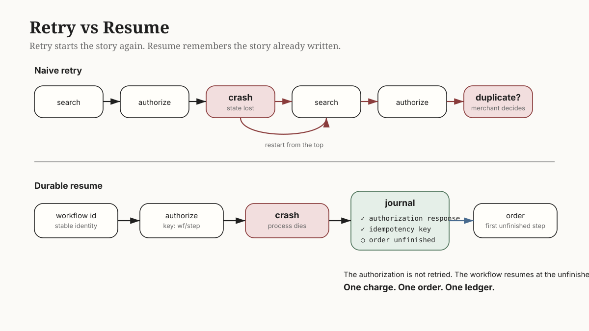

```text
NAIVE RETRY

search ──► authorize ──► CRASH
                         state lost
search ──► authorize ──► checkout
             ▲
             └── duplicate risk now belongs to the merchant


DURABLE RESUME

workflow W
   │
   ├─ search        ✓ journaled
   ├─ authorize     ✓ response recorded, key = W/authorize
   ├─ checkout      ○ unfinished
   │
   └─ resume here ──► checkout
```

*Retry repeats the story. Resume remembers the story.*

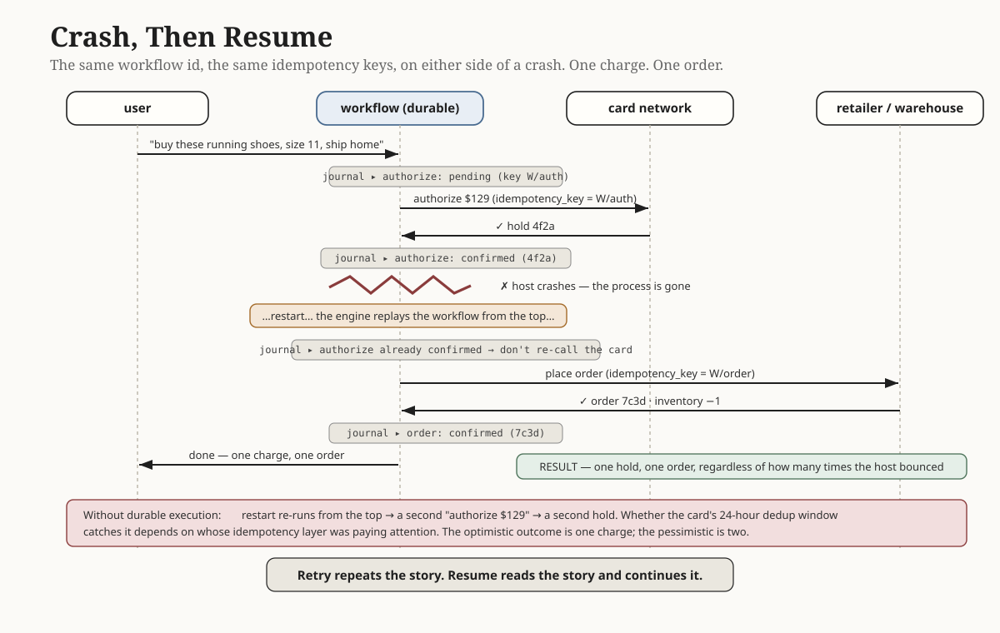

```text
user            workflow (durable)              card network        retailer
 │  buy shoes ──►│
 │               │ journal ▸ authorize: pending (key W/auth)
 │               │ authorize $129 (key=W/auth) ──────►│
 │               │◄────────────────── ✓ hold 4f2a ────┤
 │               │ journal ▸ authorize: confirmed (4f2a)
 │            ✗ CRASH — the process is gone
 │            …restart… the engine replays the workflow from the top…
 │               │ journal ▸ authorize already confirmed → don't re-call the card
 │               │ place order (key=W/order) ─────────────────────────────►│
 │               │◄─────────────────────────── ✓ order 7c3d, inv −1 ───────┤
 │               │ journal ▸ order: confirmed (7c3d)
 │  ◄── done ────┤   one hold, one order — however many times the host bounced

Without durable execution: restart re-runs from the top → a second "authorize $129"
→ a second hold; the card's 24-hour dedup window may or may not catch it.
```

*The same workflow id, the same idempotency keys, on either side of a crash. Retry repeats the story; resume reads the story and continues it.*

### The travel agent

1/ Travel is shopping with a longer time horizon and more vendors. It gets harder along both axes.

2/ A round trip to Singapore. Outbound flight, return flight, hotel, sometimes a car, a payment processor. Five external systems. None know about each other. None agree on what time it is. None will tell the agent anything it did not ask for.

3/ The interesting failure is the partial commit. Outbound booked. Return rejected because the fare class disappeared in the fifteen seconds since the search.

4/ Now the user has half a trip and a charge. Three responses are available. Cancel the outbound and refund — compensation. Retry the return at the next available fare — forward recovery. Surface the failure and wait — escalation.

5/ Each is a real saga path. None of them are reachable without a runtime that remembers what was committed and what was not.

6/ Time adds a second axis. Travel approvals come from partners, expense systems, managers. The agent presents an itinerary and waits. The wait may be ten minutes or two days.

7/ During that wait, the process holding agent state cannot stay pinned in memory. The operator deploys. The host autoscales. The cluster reschedules. Without durable suspend, the agent loses its place; the human approval becomes orphaned; the user clicks *approve*, and nothing happens, because nothing on the other side is listening anymore.

8/ Travel also exposes the freshness problem in its sharpest form. The price seen at search time is not the price at booking time. Durable execution does not solve this. What it does is force the choice to be explicit. You design a re-fetch step immediately before commit. You journal its result. The workflow consumes the fresh price, not the stale search result. The runtime does not smuggle freshness in; it makes every step declare whether its data is snapshot or live.

9/ The hard part of travel is not booking. It is unbooking. Any travel agent that can commit but cannot roll back is a travel agent that should not be authorised to commit.

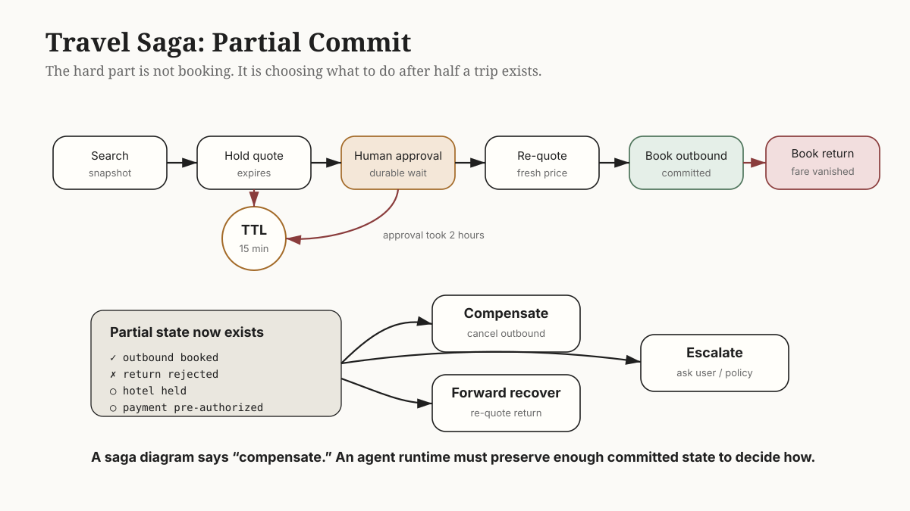

```text
search ─► hold quote ─► wait for approval ─► re-quote ─► book outbound ✓ ─► book return ✗
             │                    │
             │                    └── approval arrives after quote expiry
             ▼
          TTL expires

PARTIAL STATE
  outbound: booked
  return:   rejected
  hotel:    held
  payment:  pre-authorized

NEXT STEP IS NOT “RETRY”
  ├─ compensate: cancel outbound
  ├─ recover:    re-quote return
  └─ escalate:   ask user / policy
```

*A travel agent is not finished when it can book. It is finished when it knows what to do after half a trip exists.*

### The treasury agent — a walk through one day

The third case is the one with the highest cost of getting wrong, and it is worth walking through in full because the walk reveals what the developer ends up writing when the framework declines to.

#### The scenario

1/ The CFO writes the standing policy each morning. How much cash sits in each operating account. Where the excess sweeps to. Which counterparties are allowed. What FX exposures are tolerable, and at what notional. What amounts cross the line into *ask me first*. The policy is short. The policy is binding. The policy is what the regulator will compare against, line by line, when something goes wrong.

2/ The market closes. The agent runs. Across four banks in three currencies, it reads balances and the day's flows. It pulls rates from the data vendor. It applies the policy to the day's facts. The excess in USD operating goes to the whitelisted money-market fund. The AUD short above threshold is hedged on the agreed forward. Intercompany funding is instructed. GL entries are posted. The liquidity ratio is filed with the regulator. A summary lands on the CFO's phone before dinner.

3/ This is one run. It will run every business day. It must not over-sweep, double-hedge, miss a cutoff, or post the same entry twice. It must not pay the wrong counterparty by a digit. It must not file a ratio computed on stale balances. When it does any of these — and it will, once — the treasurer will be asked, by someone who is not in a forgiving mood, what the agent did and why.

4/ The chatbot was forgiven for forgetting. The treasury agent will not be. The agent's day is a contract with the firm, the bank, the counterparty, and the regulator, all of whom keep books, none of whom keep the agent's books for it.

#### The ceremony, in seven points

The work each tool call has to do, every time, regardless of which framework it lives in:

① **The instruction is sent twice; the money moves once.** The idempotency key is the agent's promise to the bank. The developer derives it by hand from `(run_date, account_id, amount_minor, target)` and prays the inputs are stable across retries.

② **Check the journal before acting.** If the prior attempt confirmed, return its result. The check exists because the act is not free, not undoable, and not always knowable from the bank alone.

③ **The intent is written before the wire leaves.** A crash between the write and the wire leaves a trace. A crash between the wire and the ack leaves a question. Without the pre-write, both are silence — and silence at the close is the worst state a treasury can be in.

④ **The act.** The framework treats it as a function call. The world treats it as money moved. The two treatments must be reconciled, and reconciliation is the developer's job until the runtime takes it.

⑤ **The outcome is written when it returns.** *Confirmed*, *failed*, or *unknown*. The unknown is not a developer error. It is a category of state the journal must hold, because the network can lose acks, the bank can be slow, and the cutoff is at four o'clock regardless.

⑥ **Compensation registered with the act.** The reversing entry for a misposted GL line. The cancelling instruction for a wire still in the queue. The offsetting hedge for an over-hedge. The agent that does not journal compensation handles cannot apologise to the world in time.

⑦ **The reasoning is journaled with the action, not after it.** Why this counterparty. Why this amount. Why this minute. The CFO will ask. The auditor will ask. The regulator, when it comes, will ask in writing and expect the answer in writing. The journal that records *what* without *why* is the journal of a chatbot, not an agent.

5/ Seven points. Six of them rebuild what ledgers and clearing houses solved at the boundary forty years ago. The seventh is the new ceiling — and none of the frameworks below give the developer a place to put it that survives the run.

6/ Multi-leg trades are where the discipline becomes philosophically interesting. An FX hedge is two trades that must both execute or neither execute. Without compensation primitives, a partial fill is an unhedged position the user did not ask for. With sagas, leg one is reversed if leg two fails. The agent's job is no longer *submit orders*. It is *submit orders, observe fills, compensate on partial failure, maintain the invariant the user actually wanted*. That is a saga, and a saga needs a runtime.

```text
the log tells
the journal proves
```

7/ Audit is where the journal stops being an implementation detail and becomes the deliverable. Every decision the agent made, every input it considered, every effect it submitted, every response it received — recorded, ordered, replayable. A non-durable agent has logging. It does not have audit. The difference is whether a regulator can reconstruct exactly what happened, or whether the firm has to defend a partial story.

#### LangGraph

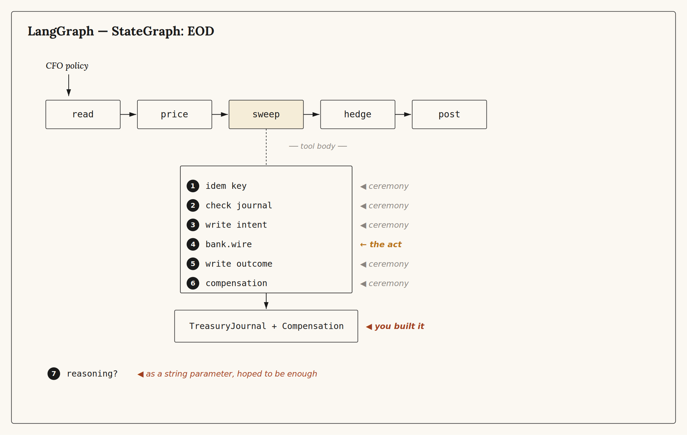

```python
from langgraph.graph import StateGraph, END
from tenacity import retry, stop_after_attempt, wait_exponential
import hashlib

@retry(stop=stop_after_attempt(3), wait=wait_exponential())
def execute_sweep(state: TreasuryState) -> TreasuryState:
    # ① idempotency — derived from inputs we hope are stable across retries
    key = hashlib.sha256(
        f"{state['run_date']}:{state['account_id']}:"
        f"{state['amount_minor']}:{state['target_mmf']}".encode()
    ).hexdigest()

    with Session(engine) as s:
        # ② check the journal we built
        prior = s.query(TreasuryJournal).filter_by(key=key).first()
        if prior and prior.status == "confirmed":
            return {**state, "wire_id": prior.wire_id}

        # ③ write intent before the wire leaves
        s.add(TreasuryJournal(
            key=key, status="pending",
            account_id=state["account_id"],
            amount_minor=state["amount_minor"],
            target=state["target_mmf"],
            rationale=state["rationale"],          # ⑦ the model's why, as a string
        ))
        s.commit()

    # ④ the act
    try:
        wire_id = bank.wire(
            account=state["account_id"],
            amount_minor=state["amount_minor"],
            target=state["target_mmf"],
            idempotency_key=key,
        )
    except UnknownAck:
        # ⑤ the third status — neither confirmed nor failed
        with Session(engine) as s:
            s.query(TreasuryJournal).filter_by(key=key).update({"status": "unknown"})
            s.commit()
        raise   # reconciliation will resolve this later
    except Exception:
        with Session(engine) as s:
            s.query(TreasuryJournal).filter_by(key=key).update({"status": "failed"})
            s.commit()
        raise

    with Session(engine) as s:
        # ⑤ write outcome
        s.query(TreasuryJournal).filter_by(key=key).update(
            {"status": "confirmed", "wire_id": wire_id}
        )
        # ⑥ register the compensation handle — what unwinds this if hedge fails
        s.add(Compensation(
            key=key, kind="reverse_wire",
            payload={"wire_id": wire_id, "account": state["account_id"]},
        ))
        s.commit()

    return {**state, "wire_id": wire_id}

graph = StateGraph(TreasuryState)
graph.add_node("read",  read_balances)
graph.add_node("price", price_market)
graph.add_node("sweep", execute_sweep)
graph.add_node("hedge", execute_hedge)        # same ceremony, repeated
graph.add_node("post",  post_gl)              # same ceremony, repeated
graph.add_edge("read", "price"); graph.add_edge("price", "sweep")
graph.add_edge("sweep", "hedge"); graph.add_edge("hedge", "post")
graph.add_edge("post", END)
```

8/ The graph is the agent. The journal is the runtime the graph declined to be.

#### ADK

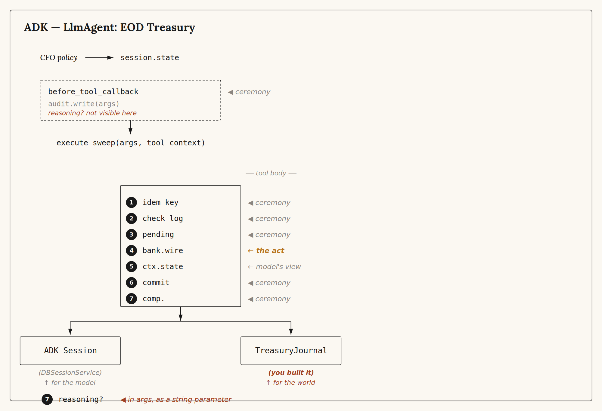

```python
from google.adk.agents import LlmAgent
from google.adk.tools import FunctionTool
from google.adk.sessions import DatabaseSessionService

session_service = DatabaseSessionService(db_url="postgresql://...")

def execute_sweep(
    account_id: str,
    currency: str,
    amount_minor: int,
    target_mmf: str,
    run_date: str,
    rationale: str,             # ⑦ the model's why, as best we can capture
    tool_context,
) -> dict:
    # ① idempotency key — invocation_id helps when inputs would otherwise repeat
    key = hashlib.sha256(
        f"{run_date}:{account_id}:{amount_minor}:{target_mmf}".encode()
    ).hexdigest()

    with side_journal() as j:
        # ② check the journal we built alongside the session
        if j.exists(key, status="confirmed"):
            return {"wire_id": j.wire_id(key)}
        # ③ write intent
        j.write(key, status="pending",
                account_id=account_id, amount_minor=amount_minor,
                target=target_mmf, rationale=rationale)

    # ④ the act
    try:
        wire_id = bank.wire(account_id, amount_minor, target_mmf, idempotency_key=key)
    except UnknownAck:
        with side_journal() as j: j.write(key, status="unknown")
        raise
    except Exception:
        with side_journal() as j: j.write(key, status="failed")
        raise

    # ⑤ session.state — what the model will read next turn
    tool_context.state[f"sweep:{account_id}:{run_date}"] = wire_id
    # ⑥ our journal — what survives the model
    with side_journal() as j: j.write(key, status="confirmed", wire_id=wire_id)
    # ⑦ compensation handle
    with comp_journal() as c:
        c.register(key, kind="reverse_wire",
                   payload={"wire_id": wire_id, "account": account_id})

    return {"wire_id": wire_id}

def before_tool_callback(tool, args, tool_context):
    # audit fires on the call. the deliberation that produced `args` and
    # `rationale` is upstream of this hook; we get the result, not the reasoning.
    audit.write({
        "invocation": tool_context.invocation_id,
        "tool": tool.name,
        "args": redact(args),
        "policy_version": tool_context.state.get("cfo_policy_version"),
    })

agent = LlmAgent(
    model="gemini-2.5-pro",
    instruction="Apply the CFO policy in session.state to today's positions.",
    tools=[FunctionTool(execute_sweep), FunctionTool(execute_hedge), FunctionTool(post_gl)],
    before_tool_callback=before_tool_callback,
)
```

9/ ADK splits the ceremony across three places — callback, tool body, session state — and the developer keeps all three in step. The session is durable. The session is the wrong shape for a ledger. Two ledgers, one process, one team paying for the gap.

#### CrewAI

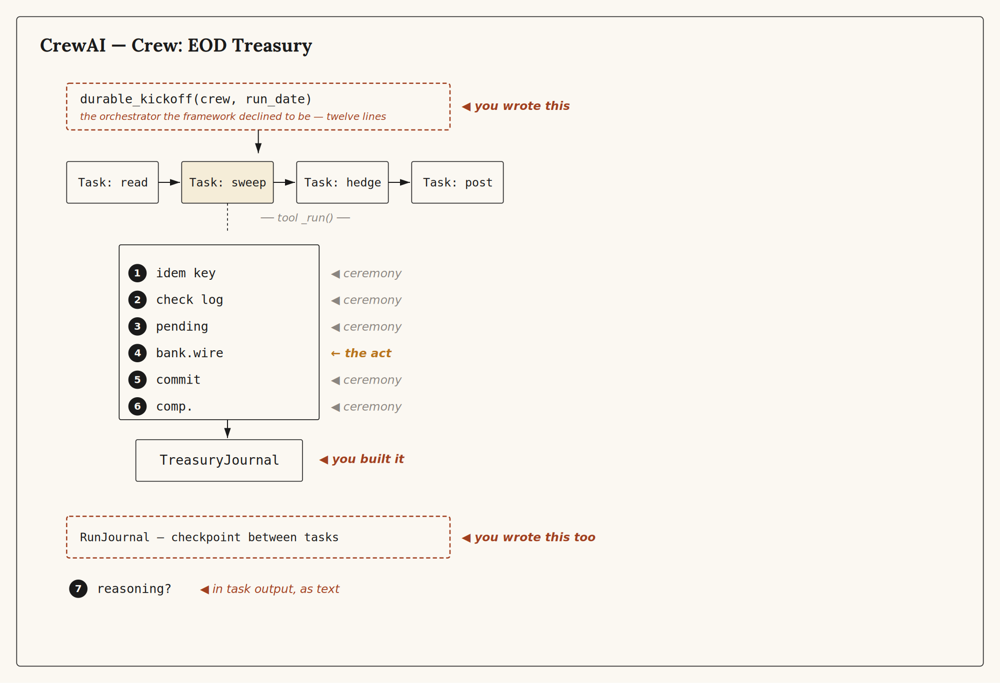

```python
from crewai import Agent, Task, Crew
from crewai.tools import BaseTool

class ExecuteSweepTool(BaseTool):
    name = "execute_sweep"
    description = "Sweep excess cash to a whitelisted MMF per CFO policy."

    def _run(
        self, account_id: str, currency: str, amount_minor: int,
        target_mmf: str, run_date: str, rationale: str,
    ) -> dict:
        # ① idem — crew gives inputs, not invocation identity
        key = hashlib.sha256(
            f"{run_date}:{account_id}:{amount_minor}:{target_mmf}".encode()
        ).hexdigest()

        # ② check
        if treasury_journal.exists(key, status="confirmed"):
            return {"wire_id": treasury_journal.wire_id(key)}

        # ③ pending
        treasury_journal.write(key, status="pending",
            account_id=account_id, amount_minor=amount_minor,
            target=target_mmf, rationale=rationale)

        # ④ the act
        try:
            wire_id = bank.wire(account_id, amount_minor, target_mmf, idempotency_key=key)
        except UnknownAck:
            treasury_journal.write(key, status="unknown");  raise
        except Exception:
            treasury_journal.write(key, status="failed");   raise

        # ⑤ commit
        treasury_journal.write(key, status="confirmed", wire_id=wire_id)
        # ⑥ compensation
        compensation_journal.register(
            key, kind="reverse_wire",
            payload={"wire_id": wire_id, "account": account_id},
        )
        return {"wire_id": wire_id}

agent = Agent(role="Treasurer", goal="Close the day per CFO policy.",
              tools=[ExecuteSweepTool(), ExecuteHedgeTool(), PostGLTool()])
crew  = Crew(agents=[agent],
             tasks=[read_task, sweep_task, hedge_task, post_task])

# Crew does not checkpoint between tasks. If `sweep` succeeds and the process
# dies before `hedge`, restart re-runs `sweep`. We write the resumption.
def durable_kickoff(crew, run_date: str):
    state = run_journal.load(run_date) or {}
    for i, t in enumerate(crew.tasks):
        slot = f"task_{i}"
        if slot in state:
            continue
        state[slot] = t.execute()
        run_journal.save(run_date, state)
    return state
```

10/ The kickoff wrapper is the orchestrator the framework declined to be. Twelve lines. They are the difference between a treasury that closes once and a treasury that closes twice.

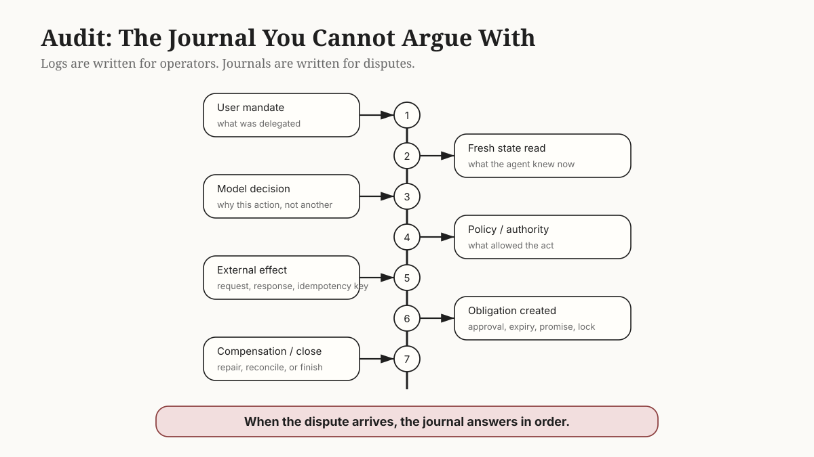

```text
AUDIT JOURNAL

1. mandate received
        │
2. fresh state read
        │
3. model decision recorded
        │
4. policy / authority checked
        │
5. external effect submitted
        │
6. obligation created
        │
7. compensation or close

When the dispute arrives, order matters.
```

*Logs are written for operators. Journals are written for disputes.*

#### What the three frameworks share

11/ One scenario. Three frameworks. The same six points wired in by hand inside each tool. The same seventh point — *why* — captured as a string parameter and hoped to be enough.

12/ The CFO's policy is in session state in ADK, in graph state in LangGraph, in task context in CrewAI. None of those places is the journal that survives the day.

```text
checkpointed state is not journaled consequence
```

13/ The retry decorator is the tell. The compensation registration is the tell. The kickoff wrapper is the tell. Each is the developer rebuilding, badly, what the boundary already knew how to do.

14/ The treasury agent does not need a smarter model. It needs a tape underneath the model that the regulator can read.

### The thread

1/ What unites the three is that the agent is not the protagonist. The protagonist is the world. The merchant's inventory. The airline's seat map. The custodian's order book. The agent is a small program negotiating commitments with larger systems that have their own opinions about what just happened.

2/ The runtime's job is to keep the agent's view of those commitments and the world's view of them in agreement across crashes, deploys, and time.

3/ Most current agent frameworks treat this as somebody else's problem. The retry decorator is the tell.

4/ Multiplied across every tool call in a multi-step agent, the developer reimplements a poor version of Temporal inside their own application, integration by integration, discovering the same edge cases in the same order the workflow community discovered them between 2014 and 2020.

---

## III. What the Old Texts Already Say

1/ Distributed systems research has spent forty years saying things that turn out to apply to agent systems with the parameters adjusted.

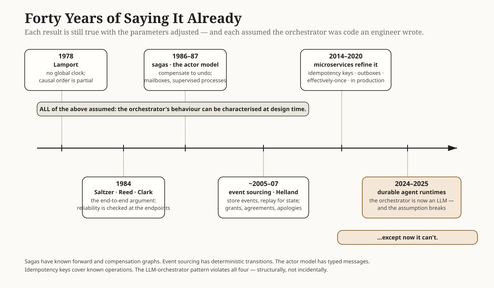

```text
1978 ──── 1984 ────── 1986–87 ─────── ~2005–07 ───────── 2014–2020 ───────── 2024–2025
Lamport   Saltzer et  sagas · the     event sourcing ·   microservices       durable agent
no global al · end-   actor model:    Helland (grants,   refine it: idem-    runtimes —
clock;    to-end:     compensate to   agreements,        potency keys,       the orchestrator
partial   check at    undo; mailboxes apologies; store   outboxes, "effec-   is now an LLM
order     the ends    + supervisors   events, replay     tively once")        → it breaks

ALL of the above assumed: the orchestrator's behaviour can be characterised at design time.   …except now it can't.
```

*Each result is still true with the parameters adjusted — and each assumed the orchestrator was code an engineer wrote. Sagas have known forward and compensation graphs; event sourcing has deterministic transitions; the actor model has typed messages. The LLM-orchestrator pattern violates all of it, structurally.*

2/ Lamport, 1978. *Time, Clocks, and the Ordering of Events*. There is no global clock. Events are ordered only by their causal relationships, and that order is partial, not total.

3/ Helland. *Life Beyond Distributed Transactions*. ACID across services is not available. What you have are grants, agreements, and partial failures.

4/ Helland again. *Memories, Guesses, and Apologies*. Distributed systems live in a world of inexact information. The right primitive is often *I think this is true; if I am wrong, I will apologise*.

5/ Saltzer, Reed, Clark, 1984. The end-to-end argument. Reliability must be verified at the endpoints. Intermediate components cannot guarantee what the endpoint cares about.

6/ A network can promise delivery. Only the receiver can confirm it. The implication for agents is direct. The vendor's confirmation is the only commitment that counts. The agent's local belief that the order was placed is not the same thing as the order having been placed.

7/ Garcia-Molina and Salem, 1987. The saga paper. Compensation as the way to maintain weakened consistency over long-running operations. If step C fails, run ¬B and ¬A.

8/ Event sourcing. Store events. Derive state by replay. The journal becomes the source of truth.

9/ The actor model. Hewitt, Agha, Erlang/OTP. Message-driven concurrency through mailbox ordering and supervised processes that survive their own faults.

10/ Every one of these primitives assumes that the orchestrator's behaviour can be characterised at design time. Sagas have known forward graphs and known compensation graphs. Event sourcing has deterministic state transitions. Idempotency keys cover known operations. The actor model has typed messages.

11/ They were designed for a world where the orchestrator was code an engineer wrote. The engineer's job was to handle network failure within the bounds of decisions the engineer had pre-specified.

12/ This is the assumption the LLM-as-orchestrator pattern violates. The violation is structural, not incidental.

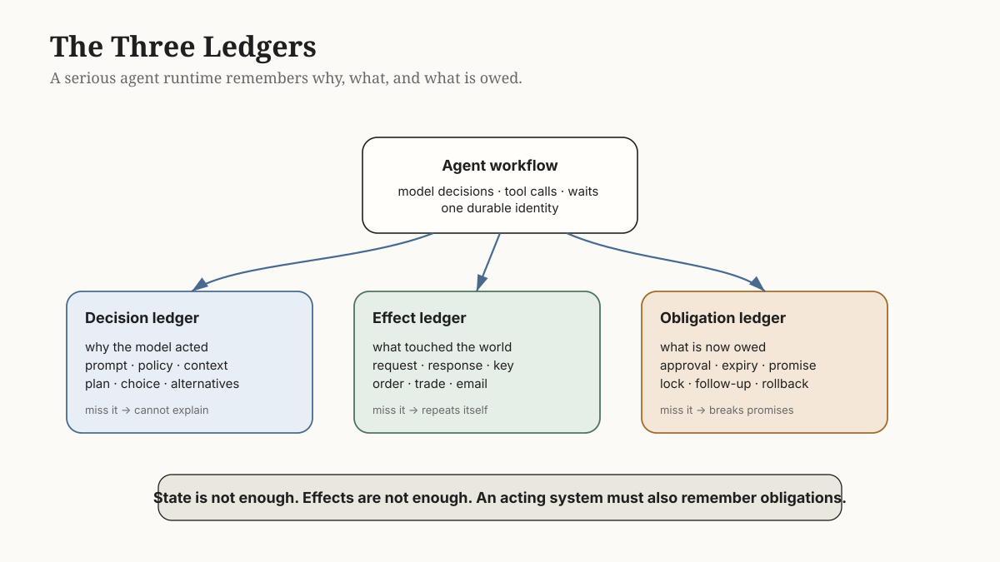

```text
                 AGENT WORKFLOW
                       │
        ┌──────────────┼──────────────┐
        │              │              │
        ▼              ▼              ▼

DECISION LEDGER   EFFECT LEDGER   OBLIGATION LEDGER
why it acted      what it did     what it owes

prompt            request         approval pending
policy            response        quote expiry
context           idempotency key customer promise
choice            order id        incident lock
alternative       trade id        rollback due

miss it:          miss it:        miss it:
cannot explain    repeats itself  breaks promises
```

*State is not enough. An acting system must remember why, what, and what is owed.*

---

## IV. The Assumption Breaks

1/ The orchestrator's decisions are no longer pre-specified. They are sampled at runtime from a model whose policy was learned, not written.

2/ The difference is visible if you write the two side by side.

```python
# Classical saga: the engineer wrote the graph at design time.
def transfer(from_acc: str, to_acc: str, amount: int) -> Receipt:
    saga = Saga()
    saga.add(debit,  from_acc, amount, compensate=credit)
    saga.add(credit, to_acc,   amount, compensate=debit)
    saga.add(notify, from_acc, to_acc, amount, compensate=None)
    return saga.execute()
# Forward path:  known.   Compensation: known.   Each step has a key.

# LLM-orchestrated agent: the trajectory is sampled at runtime.
async def agent(goal: str) -> State:
    state = State.from_goal(goal)
    while not state.done:
        action = await llm.choose_action(state, available_tools)   # ← runtime
        result = await invoke_tool(action)
        state  = state.update(action, result)
    return state
# Forward path:  not enumerable.
# Compensation:  depends on what was sampled.
# Each tool call has a key. The sequence does not.
```

3/ The first function is a graph. The second is a loop with a coin flip in the middle. The first can be reasoned about by induction. The second cannot.

```text
a saga is a graph
an agent is a trajectory
```

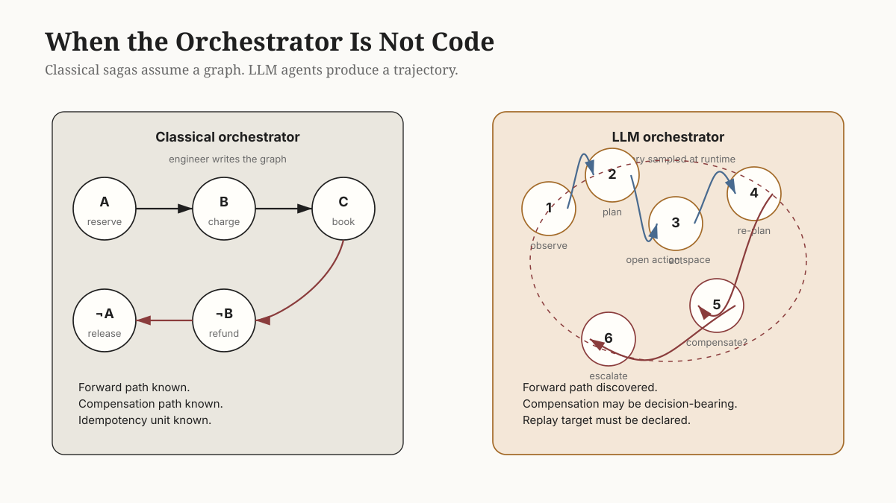

```text
CLASSICAL SAGA                         LLM AGENT TRAJECTORY

A ──► B ──► C                          observe ─► plan ─► act
│     │     │                              ▲        │       │
│     │     └─ fail                        │        ▼       ▼
│     └──────► ¬B ──► ¬A               verify ◄─ re-plan ◄─ state changed

forward path known                    forward path sampled
rollback path known                   compensation may be decision-bearing
idempotency unit known                idempotency unit must be chosen
```

*Classical orchestration is authored. Agent orchestration is discovered.*

4/ Four consequences follow.

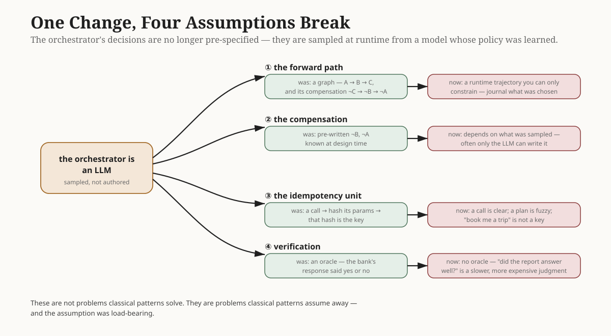

```text
                                ┌─ ① forward path:    a graph (A→B→C; ¬C→¬B→¬A)   →  a runtime trajectory you can only constrain
   the orchestrator is an LLM ──┼─ ② compensation:    pre-written ¬B, ¬A           →  depends on what was sampled; often only the LLM can write it
   (sampled, not authored)      ├─ ③ idempotency unit: a call → hash → key          →  a call is clear, a plan is fuzzy, "book me a trip" is no key
                                └─ ④ verification:    an oracle said yes / no       →  no oracle; "did the report answer well?" is a slower judgment
```

*One change — the orchestrator's decisions are sampled, not written — and four classical assumptions stop holding. These are not problems classical patterns solve; they are problems classical patterns assume away, and the assumption was load-bearing.*

5/ The forward path is not a graph the engineer can enumerate. It is a runtime trajectory the engineer can only constrain. Where the saga literature said *here is A → B → C and here is its compensation ¬C → ¬B → ¬A*, the agent literature has to say *the agent will choose actions from this space at runtime, and we will have to journal what it chose so we can compensate it*.

6/ The compensation depends on what the LLM did. It cannot be pre-written, because the forward path was not pre-written. Often the only thing positioned to write the compensation is the LLM itself, given the partial state and the goal.

7/ The idempotency unit is fuzzy. A single tool call is clear; the call has parameters, the parameters can be hashed, the hash is the key. An LLM-generated plan is less clear; the same prompt can produce different plans, and the plans are not naturally addressable. An agentic objective is very unclear. *Book me a trip to Singapore* is not a key.

8/ The verification gap widens. Classical patterns assumed there was an oracle for *did the operation succeed*. The bank's response said yes or no. For an agent task — *did the research report answer the question well*, *did the support response satisfy the customer*, *did the coding agent fix the bug* — there is no oracle. There is only a slower, more expensive judgment, often by another model, often by a human.

9/ These are not problems classical patterns solve. They are problems classical patterns assume away.

---

## V. Six Places It Breaks

A short tour. Six classes of agent. Six places the inherited toolkit runs out.

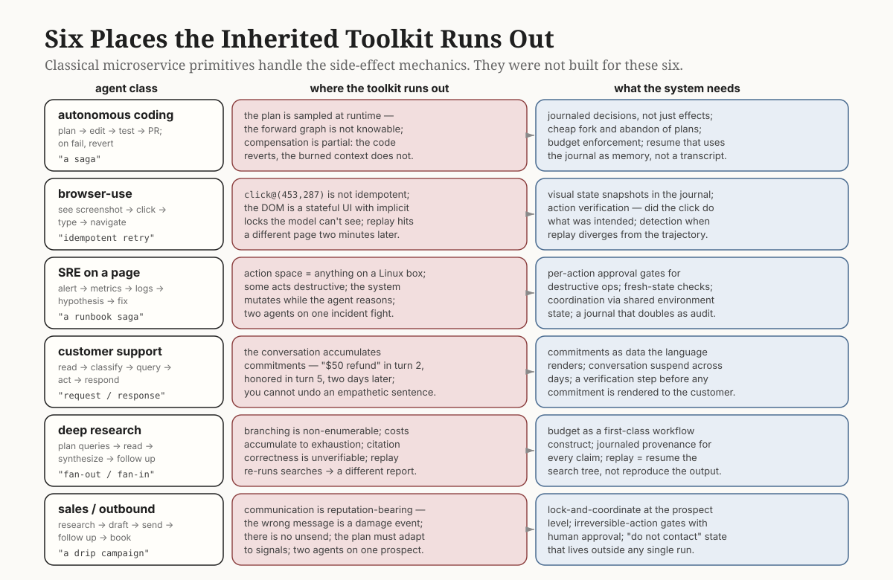

```text
AGENT CLASS            WHERE THE TOOLKIT RUNS OUT             WHAT THE SYSTEM NEEDS
-----------            --------------------------             ---------------------
coding agent           plan sampled at runtime →              journaled decisions · cheap
"a saga"               graph unknowable; revert undoes        fork/abandon · budgets ·
                       code, not burned context              journal-as-memory replay

browser agent          click@(x,y) not idempotent;            visual snapshots · action
"idempotent retry"     the DOM has hidden locks;              verification · replay-divergence
                       replay hits a later page              detection

SRE agent              action space = the whole box;          per-action approval gates · fresh-
"a runbook saga"       destructive acts; world moves          state checks · shared-state
                       while you reason; agents fight        coordination · journal = audit

support agent          commitments pile up across turns       commitments as data the language
"request/response"     and days; no undo for an               renders · suspend across days ·
                       empathetic sentence                   verify before promising

research agent         branching non-enumerable; costs        budget as a workflow construct ·
"fan-out / fan-in"     unbounded; citations unverifiable;     journaled provenance per claim ·
                       replay re-runs the searches           replay = resume the search tree

sales agent            sending is irreversible &              prospect-level locks · irreversible
"a drip campaign"      reputation-bearing; plan must          gates with human approval ·
                       adapt; two agents = damage            "do not contact" outside any run
```

*Classical microservice primitives handle the side-effect mechanics — idempotency on the call, durability on the write, compensation on the partial commit. Decision journaling, action-space management, multi-agent coordination, fresh-state verification, budget enforcement, non-deterministic replay — these are the gaps the new tools are filling.*

### The autonomous coding agent

1/ The LLM reads a ticket, plans an implementation, edits files, runs tests, iterates, opens a pull request.

2/ Classical reading: a saga. Plan, implement, test, PR. On failure, revert.

3/ The pattern breaks in three places. The plan is generated at runtime, so the saga's forward graph is not knowable when the workflow is defined. Compensation is partial: the code can be reverted, the LLM cannot. The context window has been consumed. The cost has been burned. Decisions whose value cannot be undone have been made.

4/ Replay does not reconstruct the same plan, because the plan was non-deterministic in the first place. On long-running jobs — a coding agent that owns a feature across a sprint — the journal of *what the agent did* is large and partly irrelevant.

5/ What the system actually needs. Journaled decisions, not just side effects. The ability to fork and abandon plans cheaply. Budget enforcement. Resumption that uses the journal as memory rather than as a transcript to replay verbatim.

6/ The bug, in code. The plan lives nowhere durable — it is in the model's head and, half-applied, on disk:

```python
# naive — the plan is re-sampled on restart, and it comes back different
async def coding_agent(ticket: str) -> None:
    plan = await llm.plan(ticket)                   # sampled — non-deterministic
    for step in plan.steps:
        edit_files(step.patch)
    if not run_tests().ok:
        git.reset_hard()                            # "compensation" = throw it all away
    open_pr()
# Crash after edit 3 of 7. On restart llm.plan() returns a DIFFERENT plan.
# The three edits already on disk belong to a plan that no longer exists.

# durable — the plan is an activity result; replay returns *this* plan
@workflow.defn
class CodingAgent:
    @workflow.run
    async def run(self, ticket: str) -> PR:
        plan = await workflow.execute_activity(plan_implementation, ticket, ...)
        for i, step in enumerate(plan.steps):
            await workflow.execute_activity(
                apply_patch, PatchCmd(step, idempotency_key=f"{plan.id}/patch/{i}"), ...)
        tests = await workflow.execute_activity(run_tests, ...)
        if not tests.ok:
            # not "reset" — "here is a half-applied plan and N failing tests: repair or abandon"
            await workflow.execute_activity(
                repair_or_abandon, RepairCtx(plan, applied=i + 1, tests=tests), ...)
        return await workflow.execute_activity(open_pull_request, plan, ...)
```

### The browser-use agent

1/ The LLM looks at a screenshot, decides where to click, types text, navigates, fills forms.

2/ Classical idempotency does not apply. *Click at (453, 287)* is not idempotent. The page state changes between attempts.

3/ The DOM is not a database with versioned writes. It is a stateful UI with implicit locks the LLM cannot see. Replay against the page produced two minutes later is interaction with a different page.

4/ Compensation is wildly contextual. *Undo this booking* is not a database revert. It is another agent run that must discover the booking, navigate to the cancellation flow, and confirm.

5/ What the system needs. Visual state snapshots in the journal. Action verification — *did the click do what was intended*. The ability to detect when replay has diverged from the journaled trajectory.

6/ The check, in code. A click is addressed by pixel; the journal records the pixel *and* a hash of the screen it was taken against; replay re-screenshots first:

```python
async def durable_click(target: Point, expected_view: ViewHash) -> ViewHash:
    before = perceptual_hash(await screenshot())
    if before != expected_view:
        raise ReplayDiverged(expected=expected_view, found=before)   # this is not the page we planned against
    await click(target)
    after = perceptual_hash(await screenshot())
    if after == before:
        raise ActionHadNoEffect(target)                              # the click did nothing — do not proceed as if it did
    return after                                                     # journaled; the next action plans against this
```

### The SRE agent responding to a page

1/ The LLM reads the alert, queries metrics, tails logs, runs probes, forms a hypothesis, applies a fix.

2/ The action space is *anything you would run on a Linux box*. It is unbounded. Some actions are destructive. Restart a service. Scale down a fleet. Drain a node. Compensation is partial.

3/ The system being diagnosed is changing while the agent reasons. Events that occurred while the agent was thinking are not in its context.

4/ Multiple agents on the same incident can fight. One scales up. Another scales down.

5/ Audit is not optional. Regulators and incident reviewers will ask what the agent did, why, and with what authority.

6/ What the system needs. Action-level approval gates for destructive operations. Fresh-state verification before each significant action. Multi-agent coordination via shared environment state. A journal that doubles as audit.

7/ The gate, in code (in full in Section IX):

```python
DESTRUCTIVE = {"restart_service", "scale_down", "drain_node", "delete_pv"}

async def run_action(a: Action) -> Result:
    if a.name in DESTRUCTIVE:
        ok = await workflow.wait_condition(lambda: approval_for(a.id) is not None,
                                           timeout=timedelta(minutes=15))
        if not ok or approval_for(a.id).verdict != "approve":
            return Skipped(a)
    if not await workflow.execute_activity(precondition_still_holds, a, ...):   # the box changed while we waited
        return Stale(a)
    return await workflow.execute_activity(execute_on_host, a, ...)
```

### The customer support agent

1/ The LLM reads messages, classifies intent, queries account state, decides actions, responds.

2/ The conversation accumulates commitments. *I will refund $50* said in turn 2 must be honoured in turn 5. State persists across long gaps. The customer may respond two days later.

3/ Compensation logic is awkward. How do you undo an empathetic response?

4/ The LLM might commit, in language, to something the system cannot deliver. The gap between the language commitment and the system action is where the failure lives.

5/ What the system needs. Structured commitment tracking that the conversational layer renders as language but the durable layer enforces as data. Conversation suspend across days. A verification step before any commitment is rendered to the customer.

6/ The gap, in code. The model writes prose; the durable layer writes a claim — *before* the prose is sent:

```python
async def respond(turn: Turn, account: Account) -> None:
    draft = await workflow.execute_activity(draft_reply, DraftCtx(turn, account), ...)
    for promise in extract_commitments(draft):              # "$50 refund", "by Friday", "I'll escalate this"
        if not policy.permits(promise, account):
            draft = await workflow.execute_activity(redraft_without, RedraftCtx(draft, promise), ...)
            continue
        await workflow.execute_activity(record_obligation, Obligation.of(promise, turn), ...)   # data, not language
    await workflow.execute_activity(send_message, draft,
                                    idempotency_key=f"{turn.conversation_id}/{turn.n}")
# Turn 5, two days later: the workflow is still alive (durable suspend); the
# obligation recorded in turn 2 is in history; the fulfilment activity fires.
```

### The deep-research agent

1/ Open-ended question. The agent plans search queries, reads results, synthesises, follows up, builds a report.

2/ Branching is non-enumerable. What to follow up on depends on what was found.

3/ Costs accumulate. LLM calls, search calls. Without budget enforcement the agent runs to exhaustion.

4/ Citation correctness is a verification problem the system cannot easily check. Replay re-does searches and may find different results, producing a different report.

5/ What the system needs. Budget as a first-class workflow construct. Journaled provenance for every claim in the output. The recognition that *replay* for this class of agent means *resume the search tree from where it stopped*, not *reproduce the same outputs*.

6/ The shape, in code (budget in full in Section IX):

```python
@workflow.defn
class ResearchAgent:
    @workflow.run
    async def run(self, question: str) -> Report:
        frontier: list[Query] = [Query.seed(question)]            # the frontier is workflow state — in history
        findings: list[Finding] = []
        while frontier:
            q = frontier.pop()
            hits = await workflow.execute_activity(search, q, ...)
            for h in hits:
                c = await workflow.execute_activity(extract_claim, h, ...)
                findings.append(c.with_provenance(query=q, url=h.url, snippet=h.snippet))
                frontier.extend(await workflow.execute_activity(followups, c, ...))
        return await workflow.execute_activity(synthesize, findings, ...)
        # replay resumes the frontier from history; it does not re-run a single search.
```

### The sales or outbound agent

1/ The LLM researches a prospect, drafts an outreach, sends, follows up, books meetings.

2/ Communication is reputation-bearing. Sending the wrong message is not an idempotency problem to retry through. It is a damage event. Compensation is impossible. You cannot unsend an email.

3/ The agent's plan adapts to responses or non-responses. Pre-written drip sequences cannot adapt to the prospect's signals.

4/ Cross-agent coordination is critical. Two agents working the same prospect is a serious failure.

5/ What the system needs. Lock-and-coordinate primitives at the prospect level. Irreversible-action gates with human approval. Explicit *do not contact* state that lives outside any single workflow run.

6/ The guard, in code (coordination in full in Section IX):

```python
async def send_outreach(prospect_id: str, draft: Email) -> Result:
    async with prospect_lock(prospect_id):                           # durable, journaled — outlives any one run
        if await workflow.execute_activity(on_do_not_contact, prospect_id, ...):
            return Suppressed(prospect_id)
        if draft.is_first_touch:
            ok = await workflow.wait_condition(lambda: approved(prospect_id),
                                               timeout=timedelta(hours=24))
            if not ok:
                return AwaitingApproval(prospect_id)
        await workflow.execute_activity(send_email, draft,           # no compensation exists — there is no unsend
                                        idempotency_key=f"{prospect_id}/{draft.seq}")
        await workflow.execute_activity(mark_contacted, prospect_id, ...)
```

### The pattern across the six

1/ Classical microservice primitives handle the side-effect mechanics. Idempotency on the API call. Durability on the database write. Compensation on the partial commit.

2/ They do not handle decision journaling. They do not handle action-space management. They do not handle multi-agent coordination. They do not handle fresh-state verification. They do not handle budget enforcement. They do not handle non-deterministic replay.

3/ These are the gaps the new tools are trying to fill.

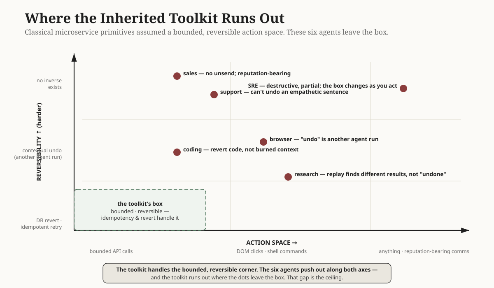

```text
  reversibility ↑ (harder to undo)
   no inverse      │ sales ●            ● support               ● SRE
   exists          │ (no unsend)          (empathetic sentence)   (destructive, partial)
   contextual undo │      ● coding              ● browser
   (another run)   │      (revert code,           ("undo" = another run)
                   │       not burned context)        ● research (replay ≠ reproduce)
   DB revert ·     │ ┌───────────────────┐
   idempotent retry│ │  the toolkit's box │  bounded · reversible — idempotency & revert handle it
                   └─┴───────────────────┴──────────────────────────────────────────► action space
                     bounded API calls   DOM clicks · shell      anything · reputation-bearing comms
```

*The toolkit handles the bounded, reversible corner — idempotency on the call, revert on the write. The six agents push out along both axes, and the toolkit runs out where the dots leave the box. That gap is the ceiling.*

---

## VI. The Idempotent-API Defence

1/ The most reasonable objection, made well, sounds like this. Stripe is idempotent on charge. The airline API is idempotent on booking. The broker is idempotent on `clOrdID`. A retry of the workflow re-fires the same call with the same key. The merchant dedupes. We do not need a durable runtime. We need disciplined idempotency.

2/ The objection is right and incomplete. Five specific ways. Each is best shown in code.

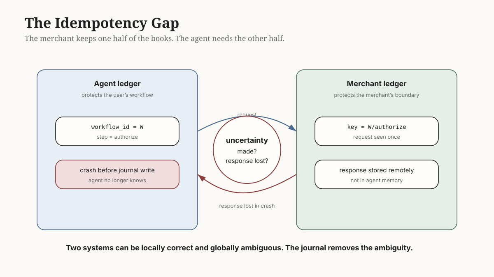

```text
AGENT LEDGER                                      MERCHANT LEDGER
protects user workflow                           protects merchant boundary

workflow W                                       key W/authorize
step authorize                                   request seen once
request sent ─────────────────────────────────► response stored

                   CRASH
                   response lost

agent after restart:
  did the call happen?
  did only the response disappear?
  should I retry?
  should I resume?

without the agent’s journal, the answer is guesswork
```

*The merchant can be correct, the agent can be correct, and the workflow can still be ambiguous.*

#### ① Fresh UUID per attempt is not idempotency. It is a guarantee of duplication.

```python
@retry(stop=stop_after_attempt(3))
def execute_sweep(state):
    key = uuid.uuid4().hex                       # ← regenerated every retry
    bank.wire(state.account, state.amount, idempotency_key=key)
```

3/ The bank receives three different keys across three attempts. It dedupes none of them. The developer wrote `@retry` and `idempotency_key=` and felt safe. Both are doing the opposite of safety.

```python
def execute_sweep(state):
    key = derive(state.workflow_id, "sweep", state.step_position)
    bank.wire(state.account, state.amount, idempotency_key=key)
```

4/ The fix needs a stable workflow identity that survives the agent's restart. The identity must come from the runtime, not from the wall clock. If the framework does not supply it, the developer has to invent it. Inventing it correctly is the job of a workflow runtime.

#### ② Per-integration dedup does not produce workflow-level idempotency.

```python
def workflow():
    bank.wire(amount, key=k1)        # ✓ dedupes at the bank
    # ... process dies here ...
    custodian.book(amount, key=k2)   # never fired
```

5/ On retry, the workflow has no record of having reached step one. `bank.wire` fires again with `k1` — the bank dedupes correctly and returns the original confirmation. But the workflow does not know this happened the first time. It sees no confirmation in its own books. It may abort. It may retry from elsewhere. It may falsely report failure to the user.

6/ The journal answers this. Idempotency at the layer below the journal does not.

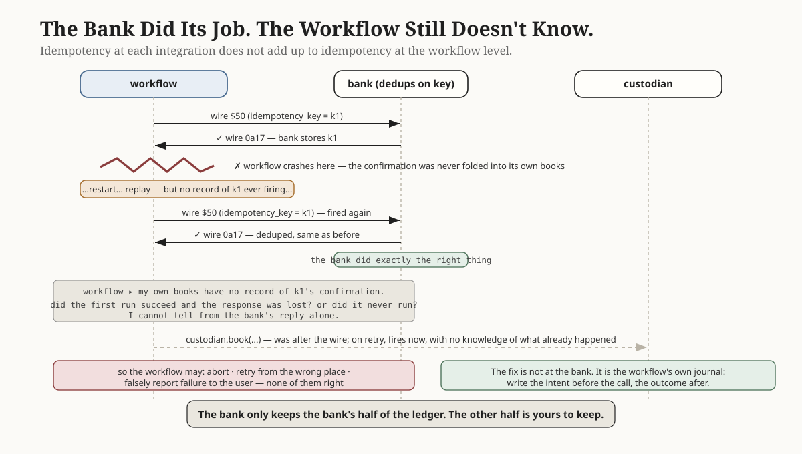

```text
workflow                          bank (dedups on key)        custodian
 │ wire $50 (key=k1) ───────────────►│ ✓ stores k1
 │◄────────────────── ✓ wire 0a17 ───┤
 ✗ workflow crashes — the confirmation was never folded into its own books
 …restart… replay — but no record of k1 ever firing…
 │ wire $50 (key=k1) ───────────────►│ ✓ wire 0a17  (deduped — the bank did exactly right)
 │◄────────────────── ✓ wire 0a17 ───┤
 │ but: my own books have no record of k1's confirmation. did the first run succeed
 │      and the response was lost? or did it never run? I can't tell from the reply.
 │ custodian.book(...) — was after the wire; on retry, fires now, with no knowledge ───►│
 │ → so the workflow may: abort · retry from the wrong place · falsely report failure

The fix is not at the bank. It is the workflow's own journal: intent before the call, outcome after.
```

*Per-integration dedup is necessary; it is not workflow-level idempotency. The bank dedupes correctly and the workflow still cannot reconstruct what happened — because the bank only keeps the bank's half of the ledger.*

#### ③ Compensation is not retry.

```python
@retry(stop=stop_after_attempt(3))
def transfer(from_acc, to_acc, amount):
    debit(from_acc, amount)         # succeeds
    credit(to_acc,  amount)         # fails — counterparty closed account
    # @retry replays the WHOLE function. debit fires twice (or dedupes).
    # credit will never succeed. It cannot.
    # The compensation — refund the debit — is never reached.
```

7/ When step two succeeded and step three fails, the system must run ¬2. ¬2 is a different operation than 2. Idempotent APIs help if the compensation needs to retry. They do not write the compensation. Frameworks that hand-wave compensation with *use try/except* are not handling it.

#### ④ Idempotency windows are bounded.

```python
def workflow():
    key = derive(...)
    bank.wire(amount, key=key)
    await human_approval()           # ← may take 48 hours
    bank.wire(remaining, key=key)    # bank's key cache is 24 hours
```

8/ Stripe holds keys for twenty-four hours. Travel approvals, settlement cycles, multi-day human-in-the-loop flows routinely run longer. The second wire is treated as new. The dedup fails silently. The runtime must either complete the operation within the window, or detect expiry and choose a recovery strategy. That logic does not exist at the API layer.

#### ⑤ Reasoning is not in any API contract.

```python
def execute_sweep(state):
    key = derive(state)
    bank.wire(state.account, state.amount, idempotency_key=key)
    # The bank journal records: account, amount, key, timestamp.
    # No record of WHY this account, this amount, this counterparty,
    # this minute. The bank does not care.
    # The auditor will.
```

9/ The agent decided to pick vendor A because of search snapshot X. It decided to allocate Y because of policy version Z. It decided to escalate because of error pattern W. None of this is an API call. None of it has an idempotency key. All of it is part of what makes the agent's behaviour auditable, replayable, defensible. The journal is where this lives. The API has no story for it.

10/ Idempotency at the API is necessary. It is not sufficient. The gap between necessary and sufficient is exactly the work the new tools are doing.

---

## VII. The Reactive Defence

1/ The other reasonable objection, and it has gotten more reasonable as the tools have gotten better. *We do not write `await` chains. We write reactions. On a state-key change, if a condition holds, the next node fires. The state machine is the orchestration; the graph runs itself; there is no imperative flow to lose. Statecharts have done this for forty years; LangGraph does it now; we do not need a durable runtime — we need a good reactive one.*

2/ The objection is right about something real. For a large class of agent work — multi-agent coordination, long-lived entities, "react to whatever happens" rather than "execute this plan" — the reactive shape *is* the better way to write it. The treasury walk's seven-point ceremony is imperative drudgery; an `onEvent` graph hides the drudgery behind declarations. And there is a genuine architectural gift in it: when the orchestration *is* the state, "where was I?" has an answer — *read the state* — that an imperative call stack does not.

3/ But it is incomplete in exactly the way the idempotency defence was incomplete. The reactive model is a choice on one axis; durability is the other axis; choosing the first says nothing about the second. Seven questions do not go away because you wrote `onEvent`.

#### ① Is the state itself durable?

4/ "On state-key change" presupposes a place the state lives. If that place is process memory, a cache, or a graph object on the heap, a crash takes your program counter with it — and the whole appeal of the model (the state is where you resume) only holds if the state outlives the crash.

```python
graph = StateGraph(AgentState)
graph.add_conditional_edges("plan", lambda s: "act" if s["ready"] else "wait")
app = graph.compile()                                   # ← in memory. crash here and the run is gone.
app = graph.compile(checkpointer=PostgresSaver(...))    # ← now it persists — at node boundaries
```

5/ So the floor of the reactive model is a durable state store. That is the easy ten per cent. Note where the checkpointer cuts: at *node* boundaries, not *effect* boundaries — the bolt-on granularity this treatise has flagged before — and the next six questions are why it matters.

#### ② Does the trigger fire exactly once?

6/ The process watching `state.x changed` crashes between observing the change and running the handler. Did the handler run? Will it run again on recovery? A reactive system needs a durable change feed with a cursor — an outbox, or change-data-capture with offsets — plus idempotent handlers, or it drops reactions and double-fires them. Postgres `LISTEN`/`NOTIFY` drops notifications when nobody is listening. "Poll the table for rows changed since my offset" *is* an outbox. "Exactly-once stream processing" is Flink and Kafka-Streams machinery. The seam did not vanish; it moved from *the workflow crashed mid-`await`* to *the trigger loop crashed mid-`react`* — and the second seam is the one the demo never shows.

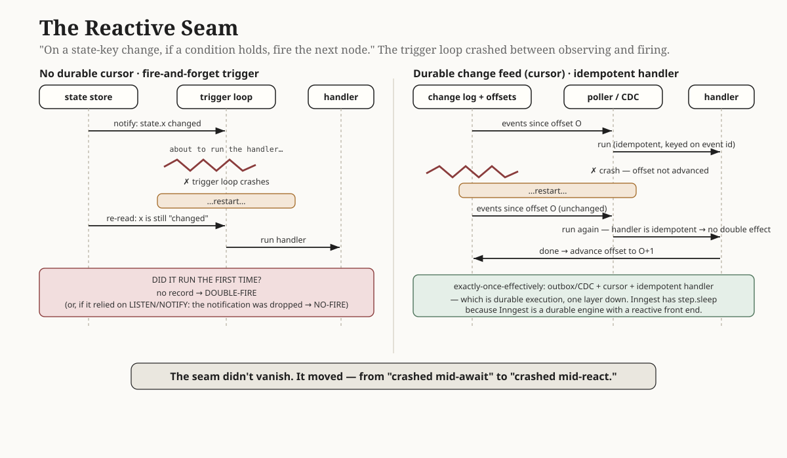

```text
NO DURABLE CURSOR                                 DURABLE CHANGE FEED + IDEMPOTENT HANDLER

state ──notify: x changed──► trigger loop         log+offsets ──events since O──► poller ──run──► handler
                              │ about to run…                                                   (idempotent,
                            ✗ CRASH                            ✗ CRASH — offset not advanced     keyed on event id)
                            …restart…                          …restart…
state ──re-read: x still changed──► loop          log ──events since O (unchanged)──► poller ──run again──► handler
                              │ run handler                                                (idempotent → no double effect)
                                                                                    └─► advance offset to O+1
DID IT RUN THE FIRST TIME?  no record →
DOUBLE-FIRE  (or, on LISTEN/NOTIFY: dropped → NO-FIRE)         exactly-once-effectively — durable execution, one layer down
```

*The seam didn't vanish — it moved, from "the workflow crashed mid-`await`" to "the trigger loop crashed mid-`react`." Closing it needs a durable change feed with a cursor and an idempotent handler. Inngest has `step.sleep` because Inngest is a durable engine with a reactive front end.*

#### ③ Is the handler itself durable?

7/ The "next node" does work — calls the model, calls the bank, books the flight. If that node is more than one step, it has the identical crash-in-the-middle problem the imperative version had: authorise succeeded, order did not, process died. The reactive shell relabelled the box; the problem is inside it. So the handler must be a journaled, resumable, idempotent unit of work — which is durable execution, one layer down, doing exactly what Section VIII shows it doing.

#### ④ Where is the timer?

8/ *If no approval within forty-eight hours, escalate.* That is a durable timer — it has to fire after deploys, restarts, the cluster rescheduling. A reactive system needs durable scheduled events for it. Inngest has `step.sleep`; that is not Inngest being reactive, that is Inngest being a durable execution engine with a reactive front end. A reactive system without durable timers can react to everything except the passage of time, which is half of what agents wait on.

#### ⑤ Is the condition still true when the handler runs?

9/ You evaluated `if state.x > threshold` and scheduled the next node; two more transitions land before it runs. That is the time-of-check-to-time-of-use race the coordination primitive in Section IX ⑥ is built to close — and the close (`@workflow.update`, an atomic check-and-set that returns whether you won) is a durable-execution primitive. Conditional triggers do not escape stale-read coordination; they are made of it.

#### ⑥ Where is the journal?

10/ A reactive store gives you, at best, a sequence of state versions. It does not give you *why* the transition happened, *what effects it fired*, *what the model decided and on what evidence*, *what obligation it created*. The decision, effect, and obligation ledgers from Section III do not fall out of an `onEvent` hook. You build them — or you have a state history where you wanted an audit, which is the difference between a log and a journal restated for the reactive paradigm.

#### ⑦ Is the replay deterministic?

11/ If the reactive system rebuilds state by replaying its transition log — and the durable ones do — the replay must be deterministic for the reasons Section XI spends a section on. And if the *condition*, or the *choice of next node*, is computed by the model rather than by `state.x > threshold`, the whole non-determinism problem is now living inside the reactive layer, in the place that looked declarative and safe.

#### The shape of the answer

12/ Same shape as the idempotency defence. The reactive model is right that there is a better *interface* for a lot of agent orchestration. It is incomplete as a *replacement* for durable execution, because durable state, plus reliable triggers, plus resumable handlers, plus durable timers, plus idempotency, plus a journal — that list *is* durable execution. Put the `onEvent` model on top of a durable runtime — Inngest, Convex, Restate's virtual objects, Temporal with signals and updates, DBOS — and you get the declarative surface and the guarantees. Put it on a plain database and a polling loop and you will re-derive the list one entry at a time, in the order the workflow community derived it, and you will not notice you are doing it until the second seam crashes in production.

```text
declarative is how you write it · durable is whether it survives
```

13/ Two axes. *Declarative versus imperative* is how the orchestration is expressed. *Durable versus ephemeral* is whether it survives a crash, a deploy, a forty-eight-hour wait. They are orthogonal. The reactive model picks a point on the first and is silent on the second.

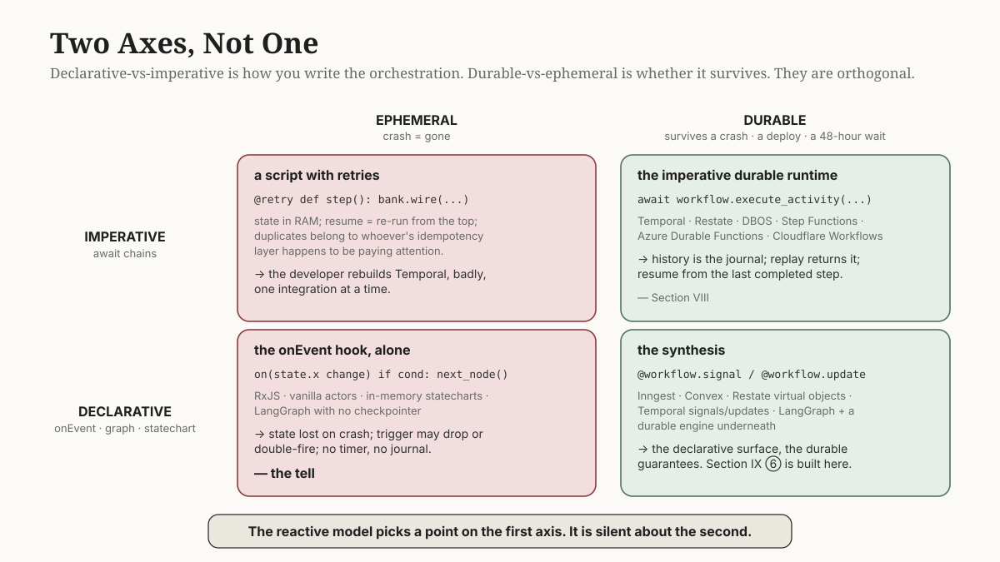

```text
                    EPHEMERAL                          DURABLE
                    crash = gone                       survives crash · deploy · 48h wait
                    -----------                        ---------------------------------
IMPERATIVE          a script with @retry decorators    Temporal · Restate · DBOS ·
await chains        — the developer rebuilds Temporal, Step Functions · Cloudflare Workflows
                    badly, one integration at a time   — the imperative durable runtime

DECLARATIVE         RxJS · vanilla actors · in-memory  Inngest · Convex · Restate virtual
onEvent · graph     statecharts · LangGraph with no    objects · Temporal signals/updates ·
                    checkpointer  ←  the tell          LangGraph + a durable engine underneath
```

*The reactive model picks a point on the first axis. It says nothing about the second. LangGraph is the case in the open — strong on axis one, thin on axis two — which is the configuration Section XII names as the one to put a durable engine* underneath*, not the one that replaces it.*

14/ The one thing the reactive model genuinely buys, restated honestly: it makes durability *easier to achieve* once the substrate is there, because state-as-program-counter is a resumption-friendly design — the reason event-sourced and statechart systems sit so well on durable runtimes. But "read the *durable* state, run the *idempotent* handler, having survived on a *durable* timer" — every adjective in that sentence is the thing the objection hoped it would not need.

```text
state-as-program-counter is durable-friendly
it is not durable
```

---

## VIII. What the New Layer Actually Does

1/ Read the documentation for any current agent runtime. Temporal. Restate. DBOS. The durability features being retrofitted into LangGraph and CrewAI. What they are converging on is a layer above the classical patterns, not a replacement for them.

2/ The clearest way to see the convergence is to walk the same treasury workflow through a runtime that takes the ceremony seriously. Compare what the developer writes.

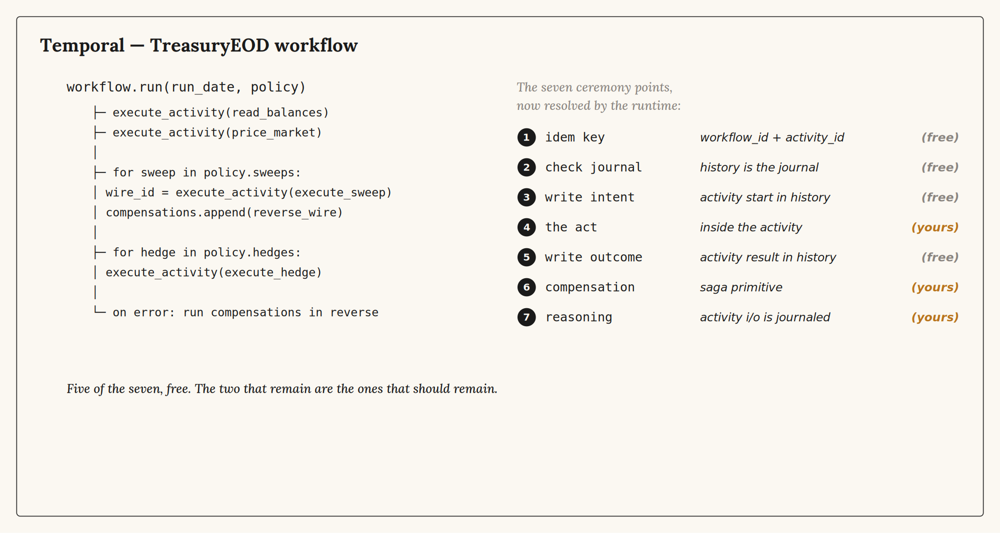

```python
from datetime import timedelta
from temporalio import workflow, activity

@activity.defn
async def execute_sweep(sweep: SweepInput) -> str:
    # ① idempotency key — derived from runtime identity, not invented
    info = activity.info()
    key  = f"{info.workflow_id}:{info.activity_id}"
    # ④ the act — and only the act
    return await bank.wire(
        sweep.account_id, sweep.amount_minor, sweep.target,
        idempotency_key=key,
    )

@workflow.defn
class TreasuryEOD:
    @workflow.run
    async def run(self, run_date: str, policy: Policy) -> Summary:
        balances = await workflow.execute_activity(
            read_balances, run_date,
            schedule_to_close_timeout=timedelta(minutes=2),
        )
        rates = await workflow.execute_activity(
            price_market, balances.currencies,
            schedule_to_close_timeout=timedelta(minutes=2),
        )

        compensations: list[tuple] = []
        try:
            for sweep in policy.compute_sweeps(balances, rates):
                wire_id = await workflow.execute_activity(
                    execute_sweep, sweep,
                    schedule_to_close_timeout=timedelta(minutes=5),
                )
                compensations.append((reverse_wire, wire_id))

            for hedge in policy.compute_hedges(balances, rates):
                await workflow.execute_activity(
                    execute_hedge, hedge,
                    schedule_to_close_timeout=timedelta(minutes=5),
                )

            await workflow.execute_activity(
                post_gl, balances, rates,
                schedule_to_close_timeout=timedelta(minutes=2),
            )
        except ActivityError:
            for fn, arg in reversed(compensations):
                await workflow.execute_activity(
                    fn, arg, schedule_to_close_timeout=timedelta(minutes=5),
                )
            raise

        return Summary(...)
```

#### How replay actually works

The Temporal version looks like ordinary `async` Python, and that is the trick: it is ordinary Python that gets *re-executed from the top* every time the workflow recovers. What makes that safe is the workflow's **history** — an append-only log of events, owned by the runtime, not by your code.

On the first run, each `await workflow.execute_activity(...)` does what it looks like: it schedules the activity, a worker runs it, the *result* is appended to history as an event. On every run after that — after a crash, a deploy, a reschedule, a worker dying mid-step — the workflow function is replayed from the start, but now each `execute_activity` call returns *the recorded result from history* instead of running the activity again. The function re-derives its control flow; the side effects do not re-fire, because the second time through they are reads, not calls. Timers, signals, child workflows, `workflow.now()`, a `workflow.random()` draw — all recorded the first time, all replayed from history thereafter.

```text
the first run makes calls
every replay makes reads
```

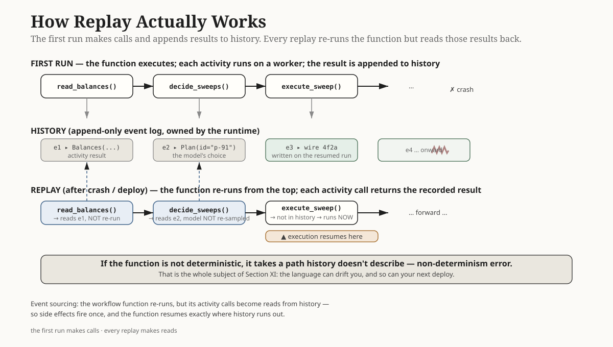

```text
FIRST RUN                                   REPLAY (after crash / deploy)
---------                                   -----------------------------
execute_activity(read_balances)  ───►        read from history  ───►  Balances(...)
   a worker runs it; result → history           (the activity is NOT re-run)
execute_activity(decide_sweeps)  ───►        read from history  ───►  Plan(id="p-91", …)
   a worker runs it; result → history           (the model is NOT re-sampled)
execute_activity(execute_sweep)  ───►        ── not in history yet ──►  a worker runs it now
   ↑ the crash happened around here             this is where execution resumes
```

This is event sourcing, and it is why "replay returns *this* object" — the sentence the next several sections lean on — is a guarantee rather than a hope. It also says exactly what you may not do: anything in workflow code whose value is *not* recorded in history must produce the same answer on every replay, or the function takes a different path than the one history describes and the engine raises a non-determinism error. That constraint is the whole subject of Section XI — and it has two faces the section takes in turn: the language can betray you, and so can your own next deploy.

3/ Compare to the LangGraph version. What disappeared.

4/ The retry decorator. Temporal retries activities by configured policy.

5/ The idempotency key derivation. `workflow_id` and `activity_id` are supplied. The developer does not invent stability; the runtime guarantees it.

6/ The `pending` write before the act. The activity start is recorded in workflow history before the activity runs. History is the journal.

7/ The `confirmed` / `failed` / `unknown` write after the act. The activity result is recorded in history when it returns. The unknown case becomes a known runtime concept (`HEARTBEAT_TIMEOUT`, `RETRY_POLICY`) rather than a custom field in a side table.

8/ The check-the-journal lookup at the top of every tool. Replay reads from history. The agent does not re-fire confirmed activities.

9/ The kickoff resumption wrapper. Workflows resume from the last completed activity automatically.

10/ What still belongs to the developer. The idempotency key handed to the bank — Temporal supplies the *stable identity*, but the bank still needs a key on its API, and the developer still passes it. The compensation logic — Temporal gives saga primitives, the developer writes the compensating activities. The reasoning — the *why* — is still passed as an activity input or output, journaled because Temporal journals all activity inputs and outputs, but with no richer semantics than that.

11/ This is the floor closing. The exactly-once writes, the compensation paths, the idempotency at workflow scope, the long-running suspend-and-resume — these are no longer the developer's invention. They are the runtime's job.

12/ The ceiling is still being built. Reasoning provenance. Action-space gates that surface destructive or irreversible actions to a human and suspend until approved. Multi-agent coordination through journaled state — when N agents share a problem, they coordinate through a journaled consistent view rather than direct messaging. Budget — token, dollar, time — as a first-class workflow construct, not a wrapper that fires after the fact. Verification at consumption — re-reading fresh state before any consequential action rather than trusting the journal. Replay semantics tuned per agent class. The runtimes are converging on these. None has the full set yet.

```text
the prompt is advice
the gate is authority
```

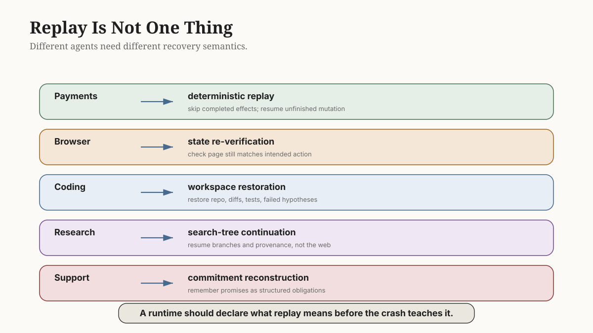

```text
AGENT TYPE     REPLAY MEANS
----------     ------------
payments       deterministic replay; skip completed effects
browser        re-verify page state before repeating action
coding         restore workspace, diffs, tests, failed hypotheses
research       resume the search tree and provenance
support        reconstruct commitments and obligations

One word, many semantics.
```

*Good runtimes declare what replay means before the crash teaches them.*

13/ None of this is solved by Postgres plus Kafka plus a saga library. None of it is a problem Postgres plus Kafka plus a saga library was designed for. The classical toolkit handles the plumbing. What sits above the plumbing is genuinely new work.

14/ The shape of the stack, when the dust settles, looks like this.

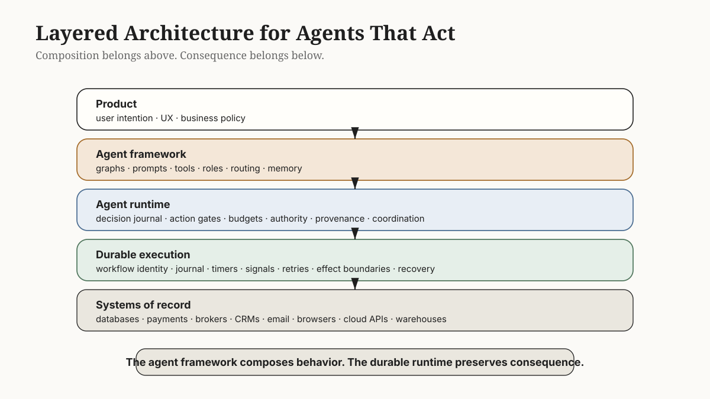

```text
┌────────────────────────────────────────────────────┐
│ PRODUCT                                            │
│ user intention · UX · business policy              │
├────────────────────────────────────────────────────┤
│ AGENT FRAMEWORK                                    │
│ graphs · prompts · tools · roles · routing         │
├────────────────────────────────────────────────────┤
│ AGENT RUNTIME                                      │
│ decisions · gates · budgets · authority · provenance│
├────────────────────────────────────────────────────┤
│ DURABLE EXECUTION                                  │
│ identity · journal · timers · signals · recovery   │
├────────────────────────────────────────────────────┤
│ SYSTEMS OF RECORD                                  │
│ payments · brokers · CRMs · email · cloud · DBs    │
└────────────────────────────────────────────────────┘
```

*Composition belongs above. Consequence belongs below. The agent framework composes behaviour; the durable runtime preserves consequence.*

---

## IX. Six Primitives of the Ceiling

1/ Section VIII showed a runtime closing the floor — retries, idempotency at workflow scope, suspend-and-resume, the compensation stack folded into a `try`/`except`. The ceiling is not one thing. It is a handful of primitives, each with a naive form that demos cleanly and a durable form that survives the year. Six of them, in code. Assume the Temporal vocabulary from Section VIII: `workflow.execute_activity`, `workflow.wait_condition`, `workflow.now`, `workflow.sleep`, `@workflow.signal`, `@workflow.query`, `activity.info`.

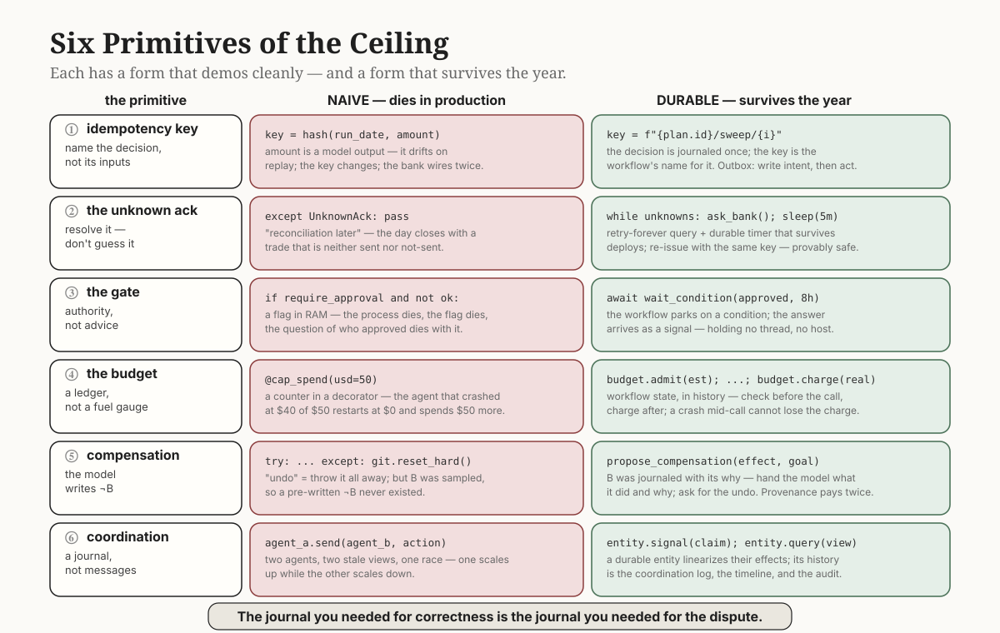

```text
PRIMITIVE                NAIVE — dies in production             DURABLE — survives the year
---------                --------------------------             ---------------------------
① idempotency key        key = hash(run_date, amount)           key = f"{plan.id}/sweep/{i}"
  name the decision      amount drifts on replay → two wires    decision journaled once; key names it

② the unknown ack        except UnknownAck: pass                while unknowns: ask_bank(); sleep(5m)
  resolve, don't guess   "reconciliation later"                 retry-forever query + durable timer

③ the gate               if require_approval and not ok: ...    await wait_condition(approved, 8h)
  authority, not advice  a flag in RAM — dies with the process  the answer arrives as a signal

④ the budget             @cap_spend(usd=50)                     budget.admit(est); ...; budget.charge(real)
  a ledger, not a gauge  resets to $0 on restart                workflow state — check before, charge after

⑤ compensation           try: ... except: git.reset_hard()      propose_compensation(effect, goal)
  the model writes ¬B    "undo" = throw it all away             ask the model, from the journaled why

⑥ coordination           agent_a.send(agent_b, action)          won = await entity.execute_update("claim")
  a journal, not messages two stale views, one race             an update (not a signal) linearizes the effects
```

*The journal you needed for correctness turns out to be the journal you needed for the dispute.*

### ① The idempotency key must name the decision, not its inputs

2/ Look again at the treasury key: `sha256(run_date, account_id, amount_minor, target)`. `amount_minor` is not an input. It is an *output* — the model computed it from the day's balances. And the day's balances can change between the original run and the replay: a late credit posts, a settlement clears an hour after cutoff.

3/ So on replay the model recomputes `amount_minor`, gets a different number, the key changes, and the bank — correctly, by its own rules — treats the instruction as new. Two wires. The idempotency layer did its job. The key was the bug.

```text
the key must name the decision, not its inputs
```

```python
# WRONG — the key is a function of values the model recomputes on replay.
def execute_sweep(state):
    amount = policy.sweep_amount(state.balances)             # recomputed on replay
    key    = sha256(f"{state.run_date}:{state.account}:{amount}".encode()).hexdigest()
    bank.wire(state.account, amount, idempotency_key=key)
# A late credit lands; read_balances returns a higher figure on the retry;
# `amount` changes; `key` changes; the bank sees a brand-new instruction. Two wires.

# RIGHT — the decision is journaled once; the key names the journal entry.
@workflow.defn
class TreasuryEOD:
    @workflow.run
    async def run(self, run_date: str, policy: Policy) -> Summary:
        balances = await workflow.execute_activity(read_balances, run_date, ...)
        # decide ONCE. the result lives in history. replay returns *this* plan,
        # not a fresh computation against possibly-changed balances.
        plan = await workflow.execute_activity(decide_sweeps, DecideIn(balances, policy), ...)
        for i, sweep in enumerate(plan.sweeps):
            await workflow.execute_activity(
                execute_sweep,
                SweepCmd(sweep, decision_id=f"{plan.id}/sweep/{i}"),     # ← stable; cannot drift
                ...,
            )

@activity.defn
async def execute_sweep(cmd: SweepCmd) -> str:
    # the key the bank sees is the workflow's name for this decision —
    # not a hash of figures the model might recompute differently next time.
    return await bank.wire(cmd.account, cmd.amount_minor, cmd.target,
                           idempotency_key=cmd.decision_id)
```

4/ The unit of idempotency is the decision, and the decision has to be a durable record *before* it is an action. That is the outbox pattern — write the intent, then do the effect — the same pattern the treasury walk hand-rolled in point ③, now placed where it belongs: the decide step, not the act step.

### ② The third outcome, and the loop that resolves it

5/ Ceremony point ⑤ named a third status — `unknown` — for the wire whose acknowledgement was lost, then waved at it: *reconciliation will resolve this later*. Later is now. The bank is the end-to-end check; its record is the truth; the workflow cannot close the day until every `unknown` has been turned into a known.

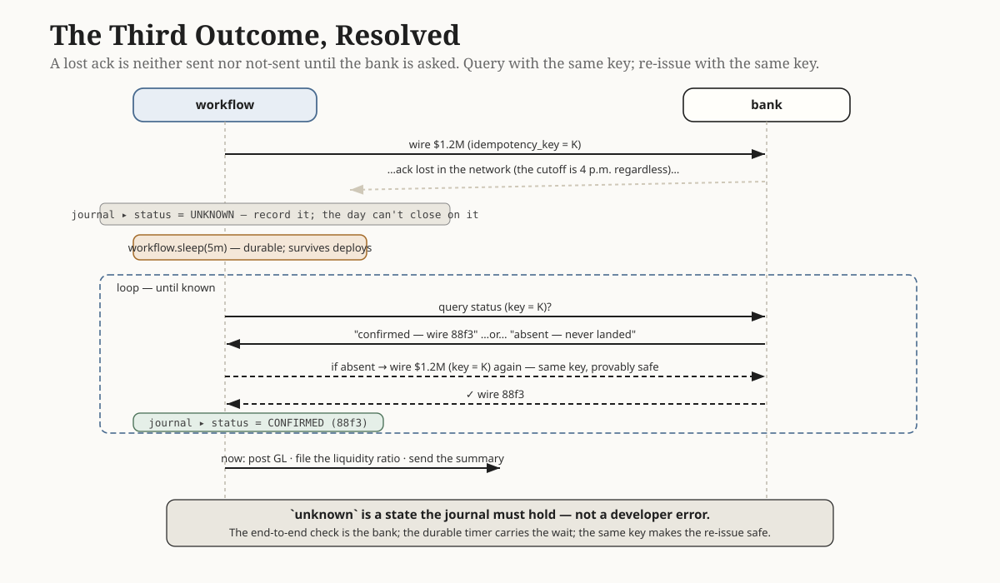

```text
workflow                                      bank
 │ wire $1.2M (key=K) ─────────────────────────►│
 │◄┄┄┄┄┄┄ …ack lost in the network… ┄┄┄┄┄┄┄┄┄┄┄┤   (the cutoff is 4 p.m. regardless)
 │ journal ▸ status = UNKNOWN — record it; the day can't close on it
 │ workflow.sleep(5m) — durable; survives deploys
 │ ┌─ loop: until known ─────────────────────────────────────────────┐
 │ │ query status (key=K)? ───────────────────────►│
 │ │◄──── "confirmed — wire 88f3"  …or…  "absent" ──┤
 │ │ if absent → wire $1.2M (key=K) again ─────────►│   (same key, provably safe)
 │ │◄────────────────────────── ✓ wire 88f3 ───────┤
 │ │ journal ▸ status = CONFIRMED (88f3)
 │ └──────────────────────────────────────────────────────────────────┘
 │ now: post GL · file the liquidity ratio · send the summary
```

*A lost ack is neither sent nor not-sent until the bank is asked. Query with the same key; re-issue with the same key; the durable timer carries the wait across deploys. `unknown` is a state the journal must hold — not a developer error.*

```python
@workflow.defn
class TreasuryEOD:
    # ...read, decide, sweep, hedge as above, each appending to self.wires...

    async def _settle_unknowns(self) -> None:
        unresolved = [w for w in self.wires if w.status == "unknown"]
        while unresolved:
            for w in unresolved:
                truth = await workflow.execute_activity(
                    query_wire_status, w.decision_id,
                    schedule_to_close_timeout=timedelta(seconds=30),
                    retry_policy=RetryPolicy(maximum_attempts=0),   # the bank owes us an answer; wait for it, across deploys
                )
                if truth.status == "confirmed":
                    w.status, w.wire_id = "confirmed", truth.wire_id
                elif truth.status == "absent":
                    # it never landed. re-issue with the SAME key — provably safe.
                    w.wire_id = await workflow.execute_activity(execute_sweep, w.cmd, ...)
                    w.status = "confirmed"
            unresolved = [w for w in self.wires if w.status == "unknown"]
            if unresolved:
                await workflow.sleep(timedelta(minutes=5))          # the bank is slow; sleep, durably
        # only now: post GL, file the liquidity ratio, send the summary.
```

6/ Two things here do real work a non-durable agent cannot. `maximum_attempts=0` — retry forever, across deploys, until the bank answers. And `workflow.sleep` — a multi-hour wait that holds no thread, no socket, no host, and survives the operator shipping a release in the middle of it. `time.sleep` in a worker process is a held resource and, if the worker dies, a lost wait.

And notice what this loop *is* and is not. It is not the journal overruling the bank. It is the journal *asking* the bank — because outcomes are the bank's to know, and intents are the journal's. The journal owns *what the agent meant to do, in what order, and why*; the counterparty owns *what actually happened*; the `unknown` lives in the gap between them. A status query — retrieve the PaymentIntent, ask FIX for `OrdStatus`, pull the PNR — is how the gap closes when the API offers one. Many do. Some do not, and there the journal is genuinely all you have. Build for that case; use the query when you can. (This is the honest reading of "the merchant only keeps their half of the ledger": a claim about who is *obligated to remember*, not a claim that the counterparty has nothing to tell you.)

### ③ The action gate is a signal, not a flag

7/ A flag — `if require_approval and not approved` — lives in the process. The process dies; the flag dies; the question of whether anyone approved dies with it. The durable form parks the workflow on a *condition* and lets the answer arrive as a *signal*, possibly hours later, possibly after three deploys, while the workflow holds nothing.

```text
a flag dies with the process · a signal waits for it
```

```python
@workflow.defn
class GuardedAction:
    def __init__(self) -> None:
        self._verdict: Verdict | None = None

    @workflow.signal
    def decide(self, v: Verdict) -> None:        # arrives from Slack, an email link, an ops console
        self._verdict = v

    @workflow.run
    async def run(self, action: Action) -> Result:
        if action.risk == "irreversible":
            await workflow.execute_activity(notify_approver, action,
                                            schedule_to_close_timeout=timedelta(seconds=30))
            got = await workflow.wait_condition(lambda: self._verdict is not None,
                                                timeout=timedelta(hours=8))
            if not got or self._verdict.outcome != "approve":
                return Result.declined(action, self._verdict)
        # the world may have moved during the wait — re-verify; do not trust the journal
        if not await workflow.execute_activity(precondition_holds, action, ...):
            return Result.stale(action)
        return await workflow.execute_activity(perform, action, ...)
```

8/ The prompt is advice. The gate is authority. The model can *propose* the irreversible action all day; the gate is the only thing that lets it *happen*, and the gate is durable state, not a runtime boolean.

### ④ Budget is a workflow object, not a wrapper

9/ A budget enforced by a decorator is a counter in memory. The agent that crashed at $40 of a $50 cap restarts at $0 and spends $50 more. A real budget is workflow state — in history, surviving replay — checked *before* the spend and charged *after* it, so a crash mid-call cannot lose the charge and cannot double it.

```text
check before · charge after · the ledger is history
```

```python
@dataclass
class Budget:
    usd_cap: float
    token_cap: int
    usd_spent: float = 0.0
    tokens_spent: int = 0

    def admit(self, est_usd: float, est_tokens: int) -> None:
        if self.usd_spent + est_usd > self.usd_cap:         raise BudgetExceeded("usd")
        if self.tokens_spent + est_tokens > self.token_cap: raise BudgetExceeded("tokens")

    def charge(self, usd: float, tokens: int) -> None:
        self.usd_spent += usd
        self.tokens_spent += tokens

@workflow.defn
class ResearchAgent:
    @workflow.run
    async def run(self, question: str, budget: Budget) -> Report:
        frontier: list[Query] = [Query.seed(question)]
        findings: list[Finding] = []
        while frontier:
            budget.admit(est_usd=0.03, est_tokens=8_000)            # refuse BEFORE the call
            q = frontier.pop()
            hits = await workflow.execute_activity(search, q, ...)
            budget.charge(hits.usd, hits.tokens)                    # recorded in history, exactly once
            for h in hits:
                claim = await workflow.execute_activity(extract_claim, h, ...)
                findings.append(claim.with_provenance(query=q, url=h.url, snippet=h.snippet))
                budget.charge(claim.usd, claim.tokens)
                if budget.usd_spent < 0.8 * budget.usd_cap:         # chase follow-ups only while there's room
                    frontier.extend(await workflow.execute_activity(followups, claim, ...))
        # replay resumes the frontier *and* the spent counters from history.
        # it does not re-run the searches, and it does not re-spend the budget.
        return await workflow.execute_activity(synthesize, findings, ...)
```

10/ Note `with_provenance`. Every claim in the report carries the query that found it, the URL it came from, the snippet it was extracted from — all journaled at the moment the claim entered the report, not reconstructed afterward from logs that may not exist. That is the answer to *how do you know this is true*, recorded when the knowing happened.

### ⑤ Adaptive compensation: the model writes the inverse

11/ A pre-written ¬B does not exist when B was sampled rather than authored. But B was journaled — its request, its response, its rationale — and that is exactly enough context to ask the model to undo it.

```text
the why is for the auditor — and for the rollback
```

```python
@dataclass
class Effect:
    kind: str
    decision_id: str
    request: dict
    response: dict
    rationale: str            # the model's why, journaled — now load-bearing twice

KNOWN_INVERSES = {            # where a deterministic undo exists, prefer it
    "wire":      reverse_wire,
    "book_room": cancel_room,
    "gl_post":   reverse_gl_entry,
}

async def unwind(effects: list[Effect], goal: str) -> None:
    for e in reversed(effects):                                       # LIFO, like a saga
        if e.kind in KNOWN_INVERSES:
            await workflow.execute_activity(KNOWN_INVERSES[e.kind], e,
                                            idempotency_key=f"comp/{e.decision_id}", ...)
            continue
        # no canned inverse — hand the model what it did and why; ask for the undo
        plan = await workflow.execute_activity(propose_compensation, CompIn(effect=e, goal=goal), ...)
        await workflow.execute_activity(validate_compensation, ValidateIn(e, plan), ...)   # cheap guardrail before any act
        for step in plan.steps:
            await workflow.execute_activity(
                perform, ToolCmd(step, idempotency_key=f"comp/{e.decision_id}/{step.seq}"), ...)
```

12/ This is why the journal records *why* and not only *what*. The auditor needs the why; so does the rollback. Provenance is not overhead carried for the regulator — it is the input to your own recovery path.

### ⑥ Coordination through journaled state, not messages

13/ Two SRE agents on one incident. Two sales agents on one prospect. The failure is one acting on the other's stale view — one scales up while the other scales down, one emails while the other is mid-call. Do not let them message each other; that trades a stale view for a racing one. Mediate through a durable entity that linearises their effects and, in doing so, *is* the coordination log.

```python
@workflow.defn
class IncidentEntity:                            # one per incident, long-lived
    def __init__(self) -> None:
        self.lease: Lease | None = None
        self.log: list[tuple] = []

    @workflow.update                             # an update, not a signal — the caller must learn whether it won
    def claim(self, agent: str, ttl: timedelta) -> bool:
        if self.lease is None or self.lease.deadline <= workflow.now():
            self.lease = Lease(holder=agent, deadline=workflow.now() + ttl)
        return self.lease.holder == agent        # atomic check-and-set; the return value *is* the answer

    @workflow.update
    def record(self, agent: str, action: Action) -> bool:
        if not (self.lease and self.lease.holder == agent):
            return False                         # you do not hold the lease — your record is rejected
        self.log.append((workflow.now(), agent, action))
        return True

    @workflow.query
    def view(self) -> IncidentView:
        return IncidentView(lease=self.lease, log=self.log)

# an SRE agent, before anything destructive:
if not await incident.execute_update("claim", me, timedelta(minutes=10)):
    return Yield(to=(await incident.query("view")).lease.holder)   # someone else holds it — stand down
await incident.execute_update("record", me, action.starting())
await workflow.execute_activity(perform, action, ...)
await incident.execute_update("record", me, action.completed())
```

14/ An update, not a signal — and the distinction is the whole point of a coordination primitive. A signal is fire-and-forget; a check-and-set is only safe if the caller learns whether it *won*; and `signal("claim"); query("view")` is a race against another agent's signal arriving in between. The update returns the verdict atomically with the change. (One workflow serialising every claim from N agents is correct and, past a certain rate, slow — the coda in Section X owes that an honest word.)

15/ The entity's history is the coordination protocol *and* the incident timeline *and* the audit trail — one structure, three readers. That is the shape of every ceiling primitive: the journal you needed for correctness turns out to be the journal you needed for the dispute.

---

## X. The Loop, Made Durable

1/ Put the six primitives together and the agent loop — observe, decide, gate, verify, act, fold, judge, compensate — fits in about seventy lines, with the durability *underneath* the loop rather than threaded through every tool body.

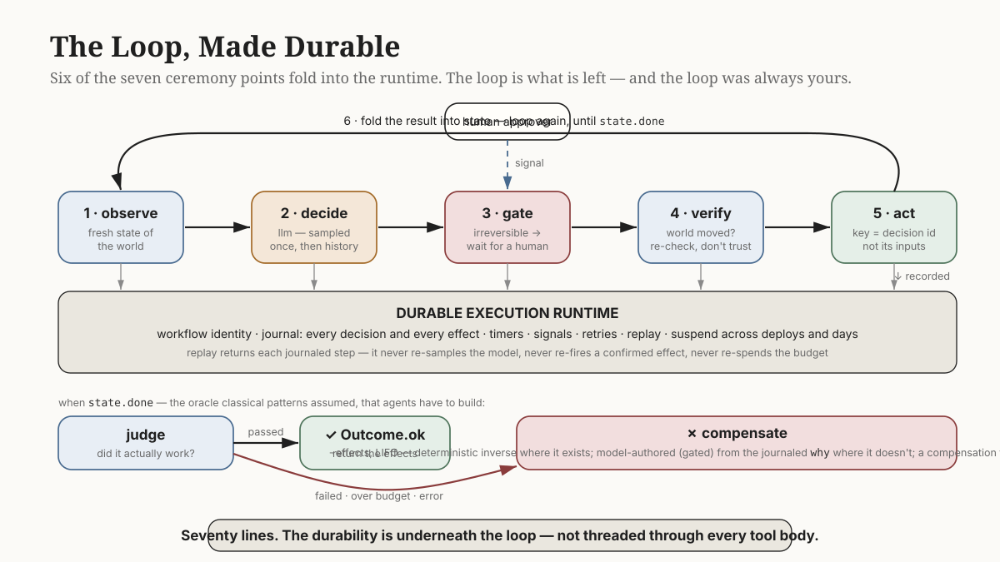

```text
        ┌────────────────── 6 · fold the result into state, loop until state.done ──────────────────┐
        ▼                                                                                           │
   ┌──────────┐    ┌──────────┐    ┌──────────┐    ┌──────────┐    ┌──────────┐                     │
   │1 observe │──► │2 decide  │──► │3 gate    │──► │4 verify  │──► │5 act     │─────────────────────┘
   │fresh     │    │llm: once,│    │human sig.│    │world     │    │key =     │
   │state     │    │then hist.│    │if irrev. │    │moved?    │    │decision id│
   └────┬─────┘    └────┬─────┘    └────┬─────┘    └────┬─────┘    └────┬─────┘
        └───────────────┴───────────────┴───────────────┴───────────────┘   every step → journaled
                                        │
   ═════════════════════════════════════▼══════════════════════════════════════════════════════════
    DURABLE EXECUTION RUNTIME — workflow identity · journal (every decision + every effect) ·
    timers · signals · retries · replay · suspend across deploys and days.
    Replay returns each step: never re-samples the model, never re-fires a confirmed effect,
    never re-spends the budget.
   ═══════════════════════════════════════════════════════════════════════════════════════════════

   when state.done →  judge ──deterministic pass · or confident pass──► ✓ Outcome.ok
                        ├──uncertain──► human review ──accept──► ✓ Outcome.ok
                        │                            └──reject──┐
                        └──failed / over budget / error─────────┴──► compensate
                              ¬effects, LIFO — known inverse, or model-authored (gated) from the why;
                              a compensation that itself fails ──► stuck, and a page
```

*Six of the seven ceremony points fold into the runtime. What is left is the loop — observe, decide, gate, verify, act, fold — which was always yours.*

```python
from datetime import timedelta
from temporalio import workflow, activity
from temporalio.common import RetryPolicy

# ── activities: every boundary-crossing thing, and nothing else, is one ───────
@activity.defn
async def observe(handle: EnvHandle) -> Observation: ...        # fresh state of the world
@activity.defn
async def llm_decide(ctx: DecideCtx) -> Decision: ...           # the one non-determinism, captured in history
@activity.defn
async def precondition_holds(ctx: PreCtx) -> bool: ...          # did the world move since `observe`?
@activity.defn
async def perform(cmd: ToolCmd) -> ToolResult: ...              # carries cmd.idempotency_key to the counterparty
@activity.defn
async def judge(ctx: JudgeCtx) -> Verdict: ...                  # the "did it actually work" oracle
@activity.defn
async def notify_approver(a: Action) -> None: ...
@activity.defn
async def propose_compensation(c: CompIn) -> CompPlan: ...
@activity.defn
async def validate_compensation(c: ValidateIn) -> None: ...     # cheap guardrail before any model-authored undo
@activity.defn
async def alert_oncall(c: StuckCtx) -> None: ...                # a saga that cannot finish unwinding pages a human

KNOWN_INVERSES: dict[str, object] = {...}

# ── the workflow: the agent loop, durable end to end ──────────────────────────
@workflow.defn
class Agent:
    def __init__(self) -> None:
        self._approval: Verdict | None = None      # human verdict on a gated action
        self._review:   Verdict | None = None      # human verdict on a low-confidence judge result
        self._effects: list[Effect] = []

    @workflow.signal
    def approve(self, v: Verdict) -> None:
        self._approval = v

    @workflow.signal
    def review(self, v: Verdict) -> None:
        self._review = v

    @workflow.query
    def trace(self) -> list[dict]:                              # a live audit feed, no extra plumbing
        return [e.public() for e in self._effects]

    @workflow.run
    async def run(self, goal: str, policy: Policy, budget: Budget) -> Outcome:
        state = State.from_goal(goal)
        try:
            while not state.done:
                # 1. observe — fresh, never carried over from the last iteration
                obs = await workflow.execute_activity(
                    observe, state.handle, schedule_to_close_timeout=timedelta(seconds=30))

                # 2. decide — sampled once; from here on it is history
                budget.admit(est_usd=0.04, est_tokens=12_000)
                decision = await workflow.execute_activity(
                    llm_decide, DecideCtx(goal, state, obs, policy),
                    schedule_to_close_timeout=timedelta(minutes=2))
                budget.charge(decision.usd, decision.tokens)
                decision_id = f"{workflow.info().workflow_id}/{decision.seq}"
                if decision.kind == "stop":
                    break

                # 3. gate — irreversible acts wait for a human, durably, holding nothing
                if policy.is_gated(decision.action):
                    await workflow.execute_activity(notify_approver, decision.action,
                        schedule_to_close_timeout=timedelta(seconds=30))
                    ok = await workflow.wait_condition(
                        lambda: self._approval is not None
                                and self._approval.decision_id == decision_id,
                        timeout=timedelta(hours=8))
                    if not ok or self._approval.outcome != "approve":
                        state = state.note_declined(decision); continue

                # 4. verify at consumption — the world may have moved since step 1
                if not await workflow.execute_activity(precondition_holds,
                        PreCtx(decision.action, obs.version),
                        schedule_to_close_timeout=timedelta(seconds=30)):
                    state = state.mark_stale(decision); continue

                # 5. act — idempotency key = the decision's identity, not its inputs
                result = await workflow.execute_activity(
                    perform, ToolCmd(decision.action, idempotency_key=decision_id),
                    schedule_to_close_timeout=timedelta(minutes=5),
                    retry_policy=RetryPolicy(maximum_attempts=8))
                self._effects.append(Effect.of(decision, result))      # decision ⊕ effect ⊕ rationale

                # 6. fold the result back; loop
                state = state.update(decision, result)

            # 7. the oracle classical patterns assumed and agents have to build —
            #    but an LLM oracle is fallible in both directions, so do not let a
            #    guess trigger an irreversible rollback.
            verdict = await workflow.execute_activity(
                judge, JudgeCtx(goal, state, self._effects),
                schedule_to_close_timeout=timedelta(minutes=2))
            if verdict.confidence == "deterministic":
                # tests passed / the API returned ok / an invariant holds: this is a `verify`,
                # not a judgment — act on it. (Financial agents live here and need no LLM judge.)
                if verdict.passed:
                    return Outcome.ok(state, self._effects)
            elif verdict.passed and verdict.confidence == "high":
                return Outcome.ok(state, self._effects)
            else:
                # low confidence, or any failure an LLM judged: ask a human, the same
                # way a gated action does. The judge proposes; a person disposes.
                got = await workflow.wait_condition(lambda: self._review is not None,
                                                    timeout=timedelta(hours=8))
                if not got or self._review.outcome == "escalate":
                    return Outcome.needs_review(state, self._effects, verdict)
                if self._review.outcome == "accept":
                    return Outcome.ok(state, self._effects)
                # the human (or the next, more expensive judge) says it is broken → compensate
            return await self._compensate(state, goal, policy, GoalNotMet(verdict.why))

        except (BudgetExceeded, ActivityError) as failure:
            return await self._compensate(state, goal, policy, failure)

    async def _compensate(self, state, goal, policy, failure) -> Outcome:
        # 8. compensation — a deterministic inverse where one exists; otherwise model-authored,
        #    but every model-authored step runs through the same gate as a forward act, an
        #    irreversible undo is escalated rather than improvised, and — because compensations
        #    fail too — the honest end-state when one does is `stuck`, which pages a human.
        stuck: list[Effect] = []
        for e in reversed(self._effects):                          # LIFO, like a saga
            try:
                if e.kind in KNOWN_INVERSES:
                    await workflow.execute_activity(KNOWN_INVERSES[e.kind], e,
                        idempotency_key=f"comp/{e.decision_id}",
                        schedule_to_close_timeout=timedelta(minutes=5))
                    continue
                plan = await workflow.execute_activity(propose_compensation,
                    CompIn(e, goal), schedule_to_close_timeout=timedelta(minutes=2))
                await workflow.execute_activity(validate_compensation, ValidateIn(e, plan),
                    schedule_to_close_timeout=timedelta(seconds=30))
                if any(s.risk == "irreversible" or policy.is_gated(s) for s in plan.steps):
                    stuck.append(e); continue                      # do not let the model improvise an irreversible undo
                for s in plan.steps:
                    await workflow.execute_activity(perform,
                        ToolCmd(s, idempotency_key=f"comp/{e.decision_id}/{s.seq}"),
                        schedule_to_close_timeout=timedelta(minutes=5))
            except ActivityError:
                stuck.append(e)                                    # the compensation itself failed
        if stuck:
            await workflow.execute_activity(alert_oncall, StuckCtx(stuck, failure),
                schedule_to_close_timeout=timedelta(seconds=30))
            return Outcome.stuck(state, self._effects, stuck, failure)
        return Outcome.compensated(state, self._effects, failure)
```

2/ Walk what each line bought. Step 2 — replay returns the same decision, because the decision is an activity result in history, not a fresh sample. Step 3 — the human gate survives a deploy, because it is a `wait_condition`, not a held connection. Step 5 — the idempotency key cannot drift, because it is the workflow's name for the decision, not a hash of recomputed figures; and the budget cannot reset, because it is workflow state. Step 7 — the judge is in history, so replay does not re-grade; and because the judge is fallible, a deterministic verdict is acted on, a confident pass is taken, and anything weaker escalates to a human rather than triggering a blind rollback. Step 8 — compensation is adaptive where it has to be (the model writes the inverse from the journaled rationale) and gated where it must be (a model-authored, irreversible undo is escalated, never improvised); and when a compensation itself fails, the loop ends in `stuck` with a page, not a lie. The `trace` query is the audit, live, for free.

3/ Seventy lines. Six of the treasury walk's seven ceremony points are gone — folded into `execute_activity`, `wait_condition`, and workflow state. The seventh — *why* — is the `decision` object, journaled because every activity input and output is journaled. What stays visible is the loop itself: observe, decide, gate, verify, act, fold, judge, compensate. That was always the part that was supposed to be yours.

### What is still hard, even here

4/ The judge is an LLM, and journaling it makes replay *consistent* — the same verdict every replay — without making it *correct*. The loop above mitigates the asymmetry: a deterministic verdict is trusted, a confident pass is taken, anything weaker escalates to a human instead of unwinding the run. But mitigation is not a solution. A false fail still costs you a rollback of something that was fine; a false pass still ships something broken; the escalation still depends on a human noticing. Verification is the open frontier. Where you have a real oracle — tests, an API status, an invariant — use it and never reach for the model; that is what the treasury agent does, and it is why a treasury agent needs no `judge` at all.

5/ Compensation is dirtier than `for e in reversed(effects)` makes it look. A model-authored undo can be wrong for the same reason the forward act was wrong, so it is bounded to reversible steps and gated like any other act. A compensation can itself fail, and then the honest state is `stuck` — a human and an alert, not a clever retry; a saga library with no `stuck` state has not finished modelling sagas. And some effects have no inverse at all — the sent email, the trade past settlement — so calling the result `compensated` is sometimes a lie. The treasury agent does not let an LLM author its wire reversal. Neither should yours, unless the stakes are small.

6/ Step 4 is a precondition check, not a divergence check. For a stateful environment — the browser, a half-edited workspace — you need more: did the observation at iteration *N+1* still match what the decision at iteration *N* assumed? When it does not, the right move is sometimes to re-decide and sometimes to abort, and knowing which means comparing journaled trajectory against live state, not just re-reading a version number.

7/ The journal is not free. A coding agent that owns a feature for a sprint accumulates a history that is large and mostly irrelevant on replay. `continue-as-new`, history pruning, summarising old segments into a checkpoint — these are real operational work, and they are the price of the property, not a bug in it.

8/ `decision_id`-as-key assumes `perform` reaches a counterparty that accepts a key. Some effects have no key: a shell command, a UI click, a robot arm in a warehouse. There the journal is the *only* record, and *did it happen* is answered by re-observation, not by asking the other side. The end-to-end argument bites hardest exactly where there is no other end to ask.

9/ Multi-agent coordination through a journaled entity (Section IX ⑥) linearises effects but can become the bottleneck — every agent funnelling through one workflow's history. Sharding the entity, leasing sub-regions, reconciling shards: the same scaling problems the workflow community already has, now with agents as the clients.

10/ None of these are reasons to skip the loop. They are the shape of the work that is left once the loop is durable — which is the shape of the ceiling, still being built. And the next-to-last section says the rest of it plainly: what is missing is large.

---

## XI. On Substrate

1/ Most of these systems are written in Python. Python is structurally hostile to most of what they require. The problems compound rather than cancel.

2/ Determinism within workflow code. Python permits non-deterministic constructs — `time`, `random`, hash randomisation, dict iteration in some contexts, threading — anywhere. Sandboxes mitigate but cannot enforce. In a world where the LLM is already a non-determinism source, having a second non-determinism source in the runtime is a recipe for replay drift.

```python
# This compiles. This runs. This passes the demo. This is wrong.
@workflow.defn
class Pricer:
    @workflow.run
    async def run(self, order: Order) -> Quote:
        jitter = random.uniform(0.98, 1.02)        # ← re-evaluated on replay → different value
        asof   = datetime.now()                    # ← re-evaluated on replay → different value
        if jitter < 1.0:
            return await workflow.execute_activity(price_low, order, asof, ...)
        return await workflow.execute_activity(price_high, order, asof, ...)
        # On replay the workflow re-derives `jitter`, takes the *other* branch,
        # expects a different activity result than the one already in history —
        # and the engine raises a non-determinism panic, or, worse, silently diverges.

# The fix: anything non-deterministic is a runtime call or an activity result.
@workflow.defn
class Pricer:
    @workflow.run
    async def run(self, order: Order) -> Quote:
        jitter = await workflow.execute_activity(roll_jitter, ...)   # journaled — same on every replay
        asof   = workflow.now()                                       # the runtime's deterministic clock
        branch = price_low if jitter < 1.0 else price_high
        return await workflow.execute_activity(branch, order, asof, ...)
```

The first version is not exotic. It is the obvious way to write it, and nothing in the language or the type checker objects. That is the point: in a system where the model is already one source of non-determinism, the substrate must not be a second — and Python is a second, unless you spend continuous effort fighting it. *Don't use `time.sleep` in workflow code* is not documentation. It is a load-bearing rule with no enforcement behind it.

3/ Concurrency. Python's three concurrency models — sync, asyncio, threading — compose poorly with each other and with durable execution. Most agent libraries mix all three. Workflow engines have to constrain user code to one model, fighting the language.

4/ State serialisation. `pickle` is fragile across Python versions and class definitions. The first deploy after a workflow goes long-running is the deploy where pickle breaks. Strongly typed alternatives like Pydantic help but are not pervasive.

5/ Hot reload. Not really possible. Long-running agents that need to be patched mid-flight are a Python anti-pattern. Erlang/BEAM was designed for this case. Python was not.

6/ Sandbox enforceability. Python's dynamism — `__import__`, `ctypes`, `exec`, monkey-patching — means the workflow sandbox is best-effort. Static-typed languages such as Go, Rust, and TypeScript with strict typing make the equivalent guarantees enforceable rather than documented.

7/ Process model. Python has no first-class actor model. Multi-agent systems on Python are bolted on with Ray, Dask, or custom infrastructure. None integrate with workflow journals natively.

8/ The cumulative effect. Durable agent execution tools targeting Python ship with dialect restrictions — *don't use `time.sleep` in workflow code*. Failure modes documented as developer rules rather than runtime guarantees. State-serialisation edge cases that surface at the worst possible moment.

9/ The TypeScript and Rust equivalents do not have these. The engineering economics of building durable agent execution in Python are uphill in a way that does not show up in greenfield benchmarks but compounds in production over months.

10/ The honest position. The next generation of agent infrastructure will probably not be Python at the runtime layer, even if it remains Python at the application layer. Python will write the agent. Something else will run it.

#### When the workflow code changes under you

11/ There is a determinism problem you cannot fix by being careful with `random`, and it is not about Python at all. The workflow code itself changes. You deploy version two while version-one instances are mid-flight — and a multi-day suspend guarantees that some are. Replay of a version-one history through version-two code reaches a branch the new code structures differently, takes the path history does not describe, and the engine refuses to proceed.

```text
every behavioural change to a long-running workflow is a migration
```

12/ Every durable runtime has an answer, and the answer is a discipline, not a switch. Temporal: `workflow.patched("v2-revalue-before-hedge")` — a marker that reads true in new code and false in replayed old code, so both paths stay consistent until every old instance has drained, after which you delete the marker, which is itself a versioned change. AWS Step Functions: version the state machine, pin executions. Restate, DBOS, the others: variations on the same idea.

```python
@workflow.run
async def run(self, run_date: str, policy: Policy) -> Summary:
    balances = await workflow.execute_activity(read_balances, run_date, ...)
    if workflow.patched("v2-revalue-before-hedge"):
        balances = await workflow.execute_activity(revalue, balances, ...)   # new in v2
    # ...v1 replays skip the branch; v2 runs take it; both reach here with consistent history...
```

13/ The consequence is the part nobody prints on the box. Every behavioural change to a long-running workflow is a migration — a window where two versions of the logic coexist, a cleanup step you cannot skip, a test that replays old histories against new code. It is schema evolution for control flow, and it is the single most underweighted operational cost of the whole category: it does not show up in a demo and it does not go away in production.

---

## XII. The Landscape

1/ The category has converged on a small set of architectural patterns implemented in different deployment models.

2/ Temporal. The most mature. Built by the team behind Cadence at Uber. Workflows written as code in Go, Java, TypeScript, Python, .NET, Ruby. Self-hosted cluster or Temporal Cloud. Production users include Snap, Netflix, HashiCorp, Box, Datadog, JPMorgan Chase. Agent integrations announced across the OpenAI Agents SDK and the Vercel AI SDK in 2025. Strong on long-running workflows and complex saga patterns. Heavier operational footprint than alternatives.

3/ Restate. Newer, from former Apache Flink and Meta engineers. Single-binary Rust runtime. Optimised for low-latency durable execution and serverless or edge deployment. Strong agent positioning with integrations across the Vercel AI SDK, the OpenAI Agent SDK, and Google ADK. Production users include 21Bitcoin for trade orchestration, Coralogix for agentic observability fleets, Deliveru for recruiting research agents. Lighter than Temporal. More opinionated about deployment.

4/ DBOS. The simplest operational model. Durable execution as an in-process library backed by Postgres. No new infrastructure beyond your existing database. Fits teams that already have Postgres at the centre and do not want a new clustered service.

5/ Cloud-provider-native. AWS Step Functions. Azure Durable Functions. Cloudflare Workflows. Step Functions is the oldest and predates the modern category, using a JSON-based state language. Azure Durable Functions runs in-process to the Functions runtime. Cloudflare brought step-based durable execution to the edge in 2025, with multi-day execution and Python support.

6/ Hosted lightweight. Inngest. Hatchet. TypeScript- and Python-first. Targeting application teams that want durable execution without standing up Temporal. Lighter integration. Narrower scope. Simpler deployment.

7/ The agent framework category. LangGraph, CrewAI, ADK. A different layer. Graph runtimes or orchestration libraries with bolted-on durability. LangGraph's checkpointers are the most mature of the bolt-ons. The granularity is at node boundaries rather than effect boundaries. The patterns are documented as user discipline rather than runtime guarantees.

```text
checkpointed state is not journaled consequence
```

8/ The realistic move for any team building an agent system that needs the properties this essay has been describing. Put a durable execution engine *underneath* the agent framework. Do not rely on the framework's own durability features.

9/ The integrations announced in 2025 across Temporal, Restate, and the major agent SDKs reflect this. The agent framework community is ceding the runtime layer to the durable execution category and focusing on the composition layer above it.

10/ The honest read of the landscape. The runtime layer is being built. The agent framework layer is, increasingly, an application of it.

---

## XIII. What This Treatise Is Glossing Over

Section X named what is still hard *inside* the loop. This is what is still hard *around* it — the places this treatise, in the service of a clean argument, has quietly assumed away, smoothed over, or drawn as a cartoon. A treatise that does not do this is a brochure.

1/ "The floor is solved" is shorthand, and shorthand has a bill. What is actually solved is at-least-once delivery, *plus* idempotent receivers, *plus* a dedup store with a finite window, *plus* a key derivation that survives restart — four real systems with four sets of failure modes. The outbox pattern's relay crashes and re-emits. The dedup store fills and evicts. The window closes mid-flight — Section VI ④ named that and did not solve it, because for many APIs there is no clean recovery: you store the result object's id, not the key, and you hope you stored it before the crash. "Solved" here means what it means when someone says "the database handles concurrency": true, with a chapter of caveats you ignore at your peril.

```text
exactly-once is at-least-once in a good coat
```

2/ The journal does not own the truth; it owns *half* of it, and the essay's repeated "the merchant only keeps their half" is the half-true half. Section IX ② said the reconciled version: the journal is the source of truth for *intent, decision, and order*; the counterparty is the source of truth for *outcome*; the `unknown` is precisely the gap between them. When the counterparty exposes a status query — retrieve the PaymentIntent, FIX `OrdStatus`, the PNR — that gap is narrow. When it does not, the gap is wide and the journal is genuinely all you have. The honest framing is not "the journal answers everything" but "build for the wide case; use the query when you can."

3/ The replay mechanism — event-sourced history, activity results read back instead of re-run — is the load-bearing wall. Section VIII finally explains it; almost everything else in this treatise stands on the assumption that you poured it correctly. If the workflow function is not deterministic, none of the guarantees hold. "Deterministic" is harder than not calling `random()` (Section XI), and harder than that again because the function changes when you deploy (Section XI, the part that is really a migration problem). The category's central promise — *your code, re-runnable* — comes with a clause in small type: *provided your code is, and stays, replayable*.

4/ "Budget as a first-class workflow construct" is generous. In every runtime today it is workflow state that *your code* checks before a spend and charges after — no engine enforces a token cap, kills a workflow at a dollar ceiling, or surfaces spend as a runtime concept. That it lives in history, and so survives replay, is the real win; "first-class" is the slide, not the product. And the genuinely hard version — *N* agents drawing on one shared pool — is not the dataclass in Section IX ④ at all; it is the coordination entity from Section IX ⑥, with all of that entity's contention, back again.

5/ "Replay semantics tuned per agent class" launders patterns into features. The runtime gives you one generic mechanism: deterministic replay of recorded effects. "Re-verify the page," "restore the workspace," "resume the search tree" are things *you build on top of it* — the divergence check in Section V is application code; "resume the frontier" is just "the frontier is workflow state." The tuning is your code. Figure 10 is a menu of patterns, not a panel of knobs.

6/ The protocols in the code are cartoons, and they are cartoons in the direction that costs you. `bank.wire(...) -> wire_id` is not a treasury interface; real ones are ISO 20022 messages, host-to-host files, and settlement confirmations that arrive hours later on a *different channel* — which makes the durability problem harder, because now you are correlating asynchronous confirmations to initiations rather than awaiting a return value. `clOrdID` carries a FIX session's worth of sequencing, resend, and `OrigClOrdID`-chaining rules. Pre-trade compliance and regulatory filing are themselves stateful, slow, externally-arbitrated processes, not function calls. The patterns generalise; the surface area in the examples does not; production is messier in the direction that hurts.

7/ Verification has no answer here, and the treatise has been honest about that, but it is worth saying flatly: there is no general oracle for "did the agent do a good job," the LLM judge is a stopgap that is fallible in both directions, and a great deal of agent reliability — maybe most of it — lives in a problem this category does not solve. Durable execution makes the agent *consistent* and *auditable*. It does not make the agent *right*.

8/ What is outside the frame entirely. *Composition*: an agent that calls sub-agents is a workflow that starts child workflows, and durable agent composition — budgets and gates and provenance that compose across a tree of agents — is its own subject this treatise flattens into one loop. *The journal as liability*: it holds every input, every model response, every line of reasoning — which is PII, secrets, a retention question, a redaction question, an access-control question, and in some jurisdictions a disclosure obligation; the lone `redact(args)` call in the ADK example is not a treatment. *Streaming versus journaled*: the user wants live progress, the workflow is the source of truth, and "now" means different things to each — bridging them (queries, signals, side-channel event streams) is real work, unmentioned. *Human-in-the-loop richer than a boolean*: real HITL is the human editing the plan, supplying the missing field, taking over, handing back — not just clicking approve. *The tax*: every step is a round-trip to a persistence layer; every long workflow's replay is slow; every long history must eventually be pruned or continued-as-new — the property has a price, and a treatise that sells the property without naming the price is selling.

```text
the property has a price · a treatise that hides it is selling
```

9/ None of this unsays the argument. The orchestrator stopped being code; the runtime has to make up the difference; the floor is old and the ceiling is new — that holds. But "the runtime makes up the difference" describes a research programme with a few good products in it, not a finished thing with a vendor. The honest version of this treatise ends where the honest version of every systems treatise ends: here is the shape of it, here is what we know, here is the part that is still hard, build carefully.

---

## XIV. Floor and Ceiling

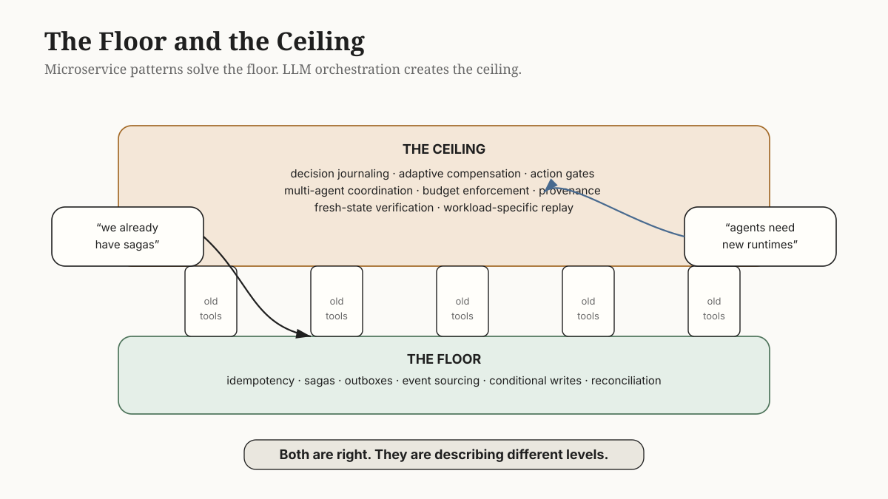

```text
                 THE CEILING
   decision journaling · adaptive compensation
   action gates · budgets · provenance · replay semantics
                 ───────────────────────────────

        old tools hold the structure up

      │ idempotency │ sagas │ outboxes │ events │ locks │

                 ───────────────────────────────
                  THE FLOOR
   durable effects · retries · timers · signals · reconciliation
```

*The old patterns are the floor. The new agent problems are the ceiling. Microservice engineering solved the floor; LLM orchestration created the ceiling. Both camps are right; they describe different levels.*

1/ The deflationary argument — *we already have sagas* — is correct for the I/O layer and incomplete for everything above it.

2/ The exactly-once writes. The compensation. The idempotency. The long-running workflow primitives that Garcia-Molina and Salem named in 1987 and that two decades of microservice engineering refined into something operational. That is the floor. It is solved.

3/ Anyone building an agent that ignores the floor will discover the same edge cases in the same order the workflow community discovered them between 2014 and 2020.

4/ Decision journaling. Adaptive compensation. Action-space management. Multi-agent coordination. Fresh-state verification. Budget enforcement. Replay semantics tuned per agent class. That is the ceiling. It is being built.

5/ The saga literature does not solve it because the saga literature did not need to. The saga literature assumed the orchestrator was code. When the orchestrator is an LLM, the assumption no longer holds, and the work above the floor is genuinely new.

6/ The people who say *we already have sagas* are right that the floor is solved. The people who say *we need new tools* are right that the ceiling is not. Both are talking past each other because the language has not separated the two.

```text
the floor is solved
the ceiling is not
```

7/ The agent durable execution category, when it survives the marketing layer, is the ceiling.

8/ The chatbot was forgiven for forgetting. The agent will not be. An agent is a contract with the world. The runtime is what keeps the contract honest.
