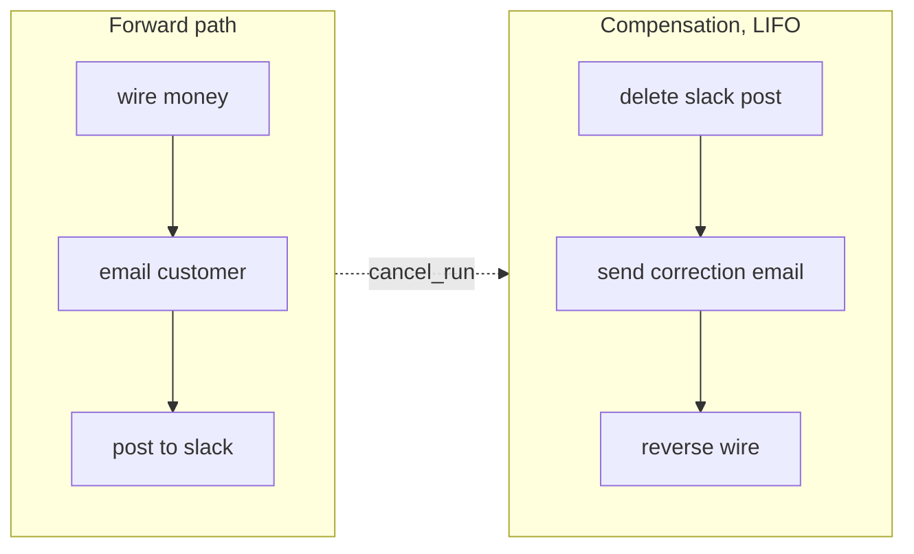

# Compensation & sagas

Some acts can't be undone. They can only be **compensated** — a *second*,
opposite act that brings the world back to where you wanted it.

> You can't un-wire money. You can wire money back.
> You can't un-send an email. You can send a correction.
> You can't un-publish a tweet. You can delete it.

This is the **saga pattern**, from Garcia-Molina & Salem (1987). Tape ships
it as a first-class primitive.

## Compensation is a different shape from retry

| Retry | Compensate |
|---|---|
| The act didn't commit; try again. | The act committed; undo it. |
| Same operation, same key. | A different operation, often a different API. |
| Owns by the outbox / reconciler. | Owns by the compensation reactor. |
| Triggered by `UNKNOWN`. | Triggered by `DUPLICATE` or `cancel_run`. |

Tape uses both, and never confuses the two.

## When compensation fires

Three triggers:

1. **The reconciler observed a `DUPLICATE`.** The reconciler enqueues a
   `compensation_obligation` with the offending external ref. The
   compensation reactor picks it up.
2. **The agent (or operator) calls `tape.compensate_run(run_id)`.** All
   confirmed effects in the run get compensation obligations in **LIFO**
   order (the saga: undo in reverse).
3. **A run cancellation crosses an effect that's already committed.**
   Same as #2 for that subset.

The compensation reactor walks each obligation, calls the registered
compensator, and marks the obligation `RESOLVED`. If `compensate()` fails
or is missing, the obligation stays `STUCK` — a human gets paged.

## How you register a compensator

Two ways:

**On the decorator:**

```python
@tape.effect(compensate=reverse_wire, status_check=bank.wire_status)
def execute_sweep(...): ...
```

**On a connector:**

```python
class BankWireConnector:
    def compensate(self, obligation):
        return http.post(f"{self.reverse_endpoint}",
                         json={"original_wire_id": obligation.external_ref})
```

The compensation reactor prefers the connector's `compensate()` if the
effect was outbox-dispatched, and falls back to the registered `compensate=`
function for inline effects.

## LIFO ordering

Compensation walks the run's confirmed effects **in reverse**. This is
the saga rule: if you wired the money, then emailed the customer, then
posted to Slack, you undo in the opposite order. (You don't compensate
the email before you've reversed the wire; the email was the *promise* of
the wire.)



## STUCK is good (again)

If a compensator fails, or the obligation can't be resolved (e.g., the
upstream's reversal API is down), the obligation moves to `STUCK`. The
run as a whole becomes `STUCK`. A human gets paged with the obligation
visible:

```bash
tape status                    # shows STUCK runs with open obligations
tape doctor --run r-...        # dump full state of one run
```

You resolve it the same way you resolve a STUCK effect — by looking at
the upstream's books, calling their support, doing a one-off reversal,
and then `tape resolve --obligation <id> --as resolved`.

## Compensation is not free

The cost is on you:

- You write the inverse operation. Tape can't infer how to un-wire.
- You make the inverse idempotent on the original effect's external ref.
  Otherwise compensating twice (under a retry) double-reverses.
- You design the upstream to *support* a reversal. If the API is
  one-shot and there's no `DELETE /wires/<id>`, you have a different
  problem to solve at the contract layer.

## A worked example

```python
@tape.effect(
    compensate=reverse_wire,
    status_check=bank.wire_status,
)
def execute_sweep(account_id, amount_minor, target_mmf, tool_context):
    key = tape.idempotency_key(tool_context)
    return {"wire_id": bank.wire(account_id, amount_minor, target_mmf,
                                  idempotency_key=key)}

def reverse_wire(obligation):
    # obligation.external_ref is the wire_id we set when CONFIRMED.
    return bank.reverse_wire(obligation.external_ref,
                              idempotency_key=f"reverse:{obligation.id}")
```

- The forward path commits.
- A duplicate is later detected → obligation enqueued.
- Compensation reactor calls `reverse_wire(obligation)`.
- `bank.reverse_wire` is itself idempotent on the obligation id — so
  re-driving the compensation reactor doesn't double-reverse.

## Next

- [Reactors](reactors.md) — the compensation reactor in context.
- [UNKNOWN — the third outcome](unknown.md) — how `DUPLICATE` gets
  detected in the first place.
- [Replay & resume](replay.md) — what `cancel_run` does to an
  in-flight trajectory.
