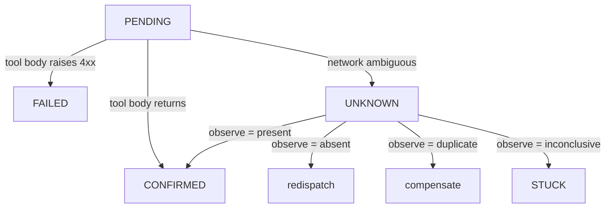

# Effects & idempotency

An **effect** is a tool call that touches the outside world. In Tape every
tool call is an effect, and every effect has a **declared semantics** that
determines what's safe to do when the world's behaviour is ambiguous.

## The three semantics

| `effect_semantics` | Meaning | What Tape does on UNKNOWN |
|---|---|---|
| `IDEMPOTENT` | Re-calling with the same idempotency key is safe | Retry |
| `NON_IDEMPOTENT` | Re-calling may cause a second commit | Outbox + reconcile |
| `OBSERVE_ONLY` | The body is a pure read; no side effects | Retry (it's free) |

You declare the semantics on the decorator. The decorator enforces the
declaration at decoration time. The server enforces it again at
`BeginEffect`-time.

## `@tape.effect` — idempotent tools

For tools where the upstream accepts an idempotency key and is honest
about respecting it.

```python
@tape.effect(compensate=reverse_wire, status_check=bank.wire_status)
def execute_sweep(account_id, amount_minor, target_mmf, tool_context):
    key = tape.idempotency_key(tool_context)
    return {"wire_id": bank.wire(account_id, amount_minor, target_mmf,
                                  idempotency_key=key)}
```

The idempotency key is **derived from the journal**:
`run/decision-N/<tool>/<call_idx>`. Not a hash of the inputs — those can be
recomputed differently on replay. The same call on re-drive produces the
same key, and the upstream short-circuits.

## `@tape.outbox_tool` — non-idempotent upstreams

For tools where the upstream **can't** be made idempotent (a SWIFT wire, a
one-shot side effect). The tool body **returns intent only** — the outbox
reactor performs the dispatch under a CAS lease.

```python
@tape.outbox_tool(
    connector="bank.wire",
    business_key=lambda account, amount, date, **_: f"{account}:{amount}:{date}",
    status_check=find_wire,
    compensate=reverse_wire,
)
def wire_money(account: str, amount: int, beneficiary: str, date: str):
    return {"account": account, "amount": amount,
            "beneficiary": beneficiary, "date": date}
```

The decorator **rejects** at decoration time if none of `business_key`,
`status_check`, or `compensate` is provided. The whole point is that an
UNKNOWN can be resolved; without one of those, there is no safe path
forward.

## The effect state machine



`PENDING` is the only writable state inside a tool body. The terminal
states — `CONFIRMED`, `FAILED`, `STUCK` — are written by the server or by
the reactors after they resolve the ambiguity.

## Helpers from `tool_context`

Inside a tool body, the `tool_context` carries journal-derived metadata:

```python
key      = tape.idempotency_key(tool_context)   # "r-abc/d-3/wire/0"
run_id   = tape.run_id_of(tool_context)         # "r-abc"
bkey     = tape.business_key(tool_context, "wire", account, amount, date)
ref      = tape.external_ref(tool_context)      # any upstream id you record
```

Use `tape.idempotency_key` as the idempotency header on the upstream
request. Use `tape.business_key` if the upstream can be queried by your
business identity (account+amount+date for a wire).

## The decision-time enforcement

```python
@tape.outbox_tool(connector="x")        # ← raises ValueError at import time
def naked():
    return {}
```

```
ValueError: @tape.outbox_tool on a non-idempotent upstream requires at least
one of: business_key=, status_check=, compensate=. Pass allow_unsafe=True
to override after explicit review.
```

This is deliberate. A non-idempotent tool without any resolution strategy
**cannot be safely retried**. Tape refuses to let you build such a tool by
accident.

## Why two decorators

- `@tape.effect` covers the 80% case (idempotent upstream, straightforward
  retry).
- `@tape.outbox_tool` covers the 20% that bites everyone: wires,
  one-shot side effects, brittle vendors. It's strictly more work to use,
  and that's intentional — non-idempotency is a property of the world,
  not a knob.

## Next

- [UNKNOWN — the third outcome](unknown.md) — what happens after a tool
  body fails to return cleanly.
- [Compensation & sagas](compensation.md) — what happens when the world
  committed and we wanted it not to.
- [Non-idempotent upstreams](../non-idempotent-upstreams.md) — the
  end-to-end guide with a real bank example.
