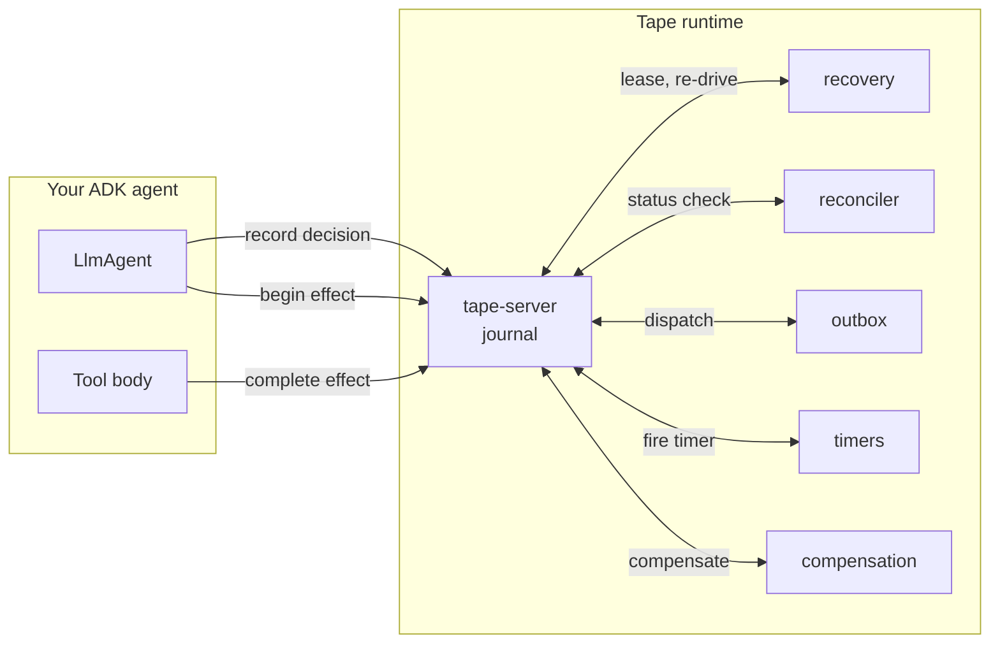

# Concepts

The mental model. Read this once, end-to-end, and the rest of the docs
clicks into place.

The whole system is built from **six primitives** and **one rule**.

!!! abstract "The rule"
    Every act the agent performs is journaled **before** it happens and
    confirmed **after** it happens. The journal is the source of truth. The
    code is replaceable.

## Read in this order

- [**Why Tape exists**](why-tape.md)
  Chatbots produce words; agents produce acts. The cost of being wrong
  about an act is not on the same scale as the cost of being wrong about a
  sentence. This is the argument.

- [**The journal**](journal.md)
  What we record, when, and why. Decisions, effects, budgets, gates,
  obligations. The journal is replayable; the agent is not.

- [**Effects & idempotency**](effects.md)
  Tool calls are *effects*. Effects have a status: `PENDING` →
  `CONFIRMED` / `FAILED` / `UNKNOWN`. Idempotent vs non-idempotent is a
  property the tool declares.

- [**UNKNOWN — the third outcome**](unknown.md)
  Most engineering assumes two outcomes: success or failure. Distributed
  systems have three. Tape makes the third one first-class.

- [**Reactors**](reactors.md)
  The five background loops that close the gaps: recovery, reconciler,
  outbox, timers, compensation. Each is idempotent. Each is replaceable.

- [**Compensation & sagas**](compensation.md)
  Some acts can't be undone — they can only be **compensated**. Tape's
  compensation registry, obligations, and the STUCK escape valve.

- [**Replay & resume**](replay.md)
  What "the agent resumes" actually means. The first seq the journal has
  no record of is the resume point. Determinism rules, exemptions, and
  `tape.sample`.

- [**Reactive shared state**](reactive-state.md)
  CAS-versioned values with watch streams. Not signals (point-to-point),
  not the WAL (cross-run) — this is fan-out, by key, with transitions.

- [**Tape vs. alternatives**](alternatives.md)
  Temporal, LangGraph durable, Pydantic AI + DBOS. Where Tape overlaps,
  where it doesn't, and why the differences are real.

## In one diagram

The agent never reaches around the runtime. The runtime never reaches into
the agent. Every interaction is one of: *record a decision*, *begin an
effect*, *complete an effect*, *await a signal*, *send a signal*, *set a
timer*, *admit budget*, *charge budget*. That list is the
[wire protocol](../design/tape.md).

## Six primitives, in one breath

1. **Journal** — append-only history of decisions, effects, budgets,
   gates, obligations. Per run.
2. **Effect** — a tool call with a declared semantics
   (`idempotent` / `non_idempotent` / `observe_only`) and resolution
   strategy (`status_check`, `business_key`, `compensate`).
3. **Reactor** — a background loop that closes a specific kind of gap
   (recovery, reconciliation, dispatch, timers, compensation).
4. **Connector** — a typed adapter to one upstream. Three methods:
   `dispatch`, `observe`, `compensate`.
5. **Gate** — a `LongRunningFunctionTool` that suspends the run until a
   signal arrives (or a timer fires).
6. **Budget** — run-level dollars and tokens, *journaled*. `AdmitBudget`
   before, `ChargeBudget` after.

That's it. Everything else is wiring.

## And then go build

When you've read the concepts, the [**how-to guides**](../how-to/index.md)
turn into a buffet of recipes for specific problems. The
[**reference**](../reference/index.md) is the API surface, generated from
docstrings. The [**design**](../design/index.md) section is the long-form
argument and the spec.
