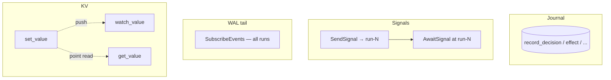

# Reactive shared state

The journal is *history*. The KV is *live state*. They have different
durability properties and different access patterns. Mixing them is a
footgun.

## The shape

Tape's reactive KV is **CAS-versioned, watchable, namespaced**. Three
operations:

```python
import tape

# Write — optionally with optimistic concurrency.
tape.set_value(ns="treasury/sweep", key="status", value="planning")
tape.set_value(ns="treasury/sweep", key="status", value="confirming",
               if_version=1)        # only updates if current_version == 1

# Read — latest value + version.
v = tape.get_value(ns="treasury/sweep", key="status")
# → ValueEvent(value="confirming", version=2, prev_value="planning", prev_version=1)

# Watch — stream from a starting version forward.
for evt in tape.watch_value(ns="treasury/sweep", key="status", from_version=0):
    # evt.prev_value -> evt.value (transition), with versions on both sides
    ...

# Delete — tombstone; watchers see one final event with deleted=True.
tape.delete_value(ns="treasury/sweep", key="status")
```

## What it's for

| Use case | KV is right because |
|---|---|
| The agent emits progress signals a UI wants to render. | Watchers don't poll; they get pushes. |
| A human approves a step; the agent should know immediately. | Gate + signal works too, but if the approval is on *value* (not on *time*), the KV transition is the right shape. |
| Two runs coordinate on shared budget. | CAS prevents double-spend. |
| You want to fan out a status change to N consumers. | `watch_value` is multi-subscriber. |

## What it's not for

| Wrong use | Why |
|---|---|
| Recording history. | That's the journal. |
| Storing run state the recovery reactor needs to resume. | Same — journal. |
| Fan-out to *every run's* journal updates. | That's the WAL tail (`SubscribeEvents`). |
| Point-to-point messaging with a return value. | That's signals (`SendSignal` / `AwaitSignal`). |

## How it differs from signals and the WAL



- **Journal** — per-run, append-only history. Source of truth for the
  *run*.
- **Signals** — point-to-point, single-consumer. "Tell *this* run to
  wake up."
- **WAL tail** — cross-run, journal-of-everything. "Fan out every
  journal entry to a sink (Pub/Sub, webhook, log)."
- **KV** — fan-out by key, CAS-versioned, multi-subscriber. "Coordinate
  state across runs and external watchers."

## Transitions, not snapshots

A `ValueEvent` carries both `value`/`version` and `prev_value`/`prev_version`.
This is intentional: watchers observe **transitions** (X: 70 → 90), not
just latest. That's the difference between a useful UI binding and one
that has to remember what it last saw.

## Tenancy

KV namespaces are scoped by the same `(app_name, user_id, session_id)`
tuple as the journal. In `hard_multi_tenant` mode (when it lands), the
tenant_id will be added. Today the runtime can't enforce cross-tenant KV
isolation; trust comes from the deploy boundary.

## Limits

- Values are JSON. Keep them small — under a few KB. The store will not
  thank you for blobs.
- Versions are monotonic per `(ns, key)`. There's no global ordering
  across keys; if you need that, journal an effect.
- Watch streams resume from a `from_version` — your subscriber owns the
  cursor.

## Next

- [The journal](journal.md) — for when you actually need history.
- [Reactors](reactors.md) — `run_event_fanout` is the WAL-tail
  consumer.
