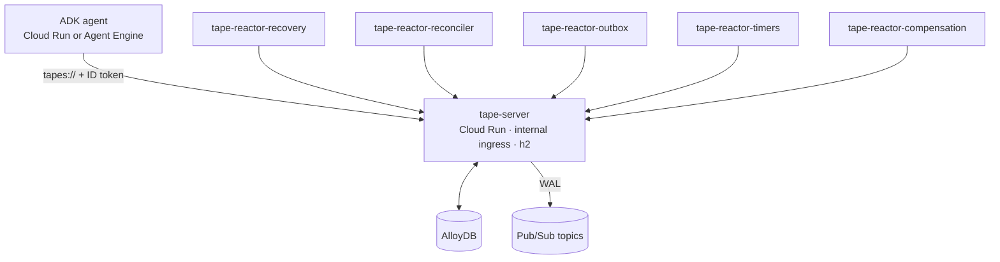

# Deploy

Tape ships two deployment patterns on GCP and a generic Helm chart for
GKE Autopilot.

<div class="tape-hub" markdown>

- [**Cloud Run (recommended)**](../gcp-cloud-run.md)
  Tape server, each reactor, and (optionally) the agent are independent
  Cloud Run services. The default production topology.

- [**GKE Autopilot**](../gcp-gke.md)
  When you need pod-level control: namespaces, network policies,
  Workload Identity, kustomize overlays.

- [**IAM cheat sheet**](iam.md)
  Service accounts, roles, and the minimum permissions Tape needs.

</div>

## One CLI composes everything

```bash
tape provision gcp --target cloud-run --apply    # Terraform
tape deploy gcp --target cloud-run               # service specs
tape doctor --gcp                                # tick/cross diagnostic
tape status                                       # runs / effects / lag
tape logs --follow                                # tail Cloud Logging
```

The generated artifacts under `deploy/gcp/terraform/` and
`deploy/gcp/release/` are **yours**. Commit them. Edit them. The CLI is
not in your way once it's emitted the files.

## What gets deployed



Plus:

- Artifact Registry for the server + reactor images.
- Secret Manager for `TAPE_STORE_URL`.
- A Cloud Monitoring dashboard with the five log-based metrics
  (`tape/runs/running`, `tape/runs/stuck`, `tape/effects/unknown`,
  `tape/obligations/unresolved`, `tape/reactor/lag_ms`).

## Choosing a topology

| If… | Use |
|---|---|
| You want lowest ops, GCP-native auth, idle-to-zero economics | **Cloud Run** |
| You need pod-level control, sidecars beyond AlloyDB Auth Proxy, or you're already on GKE | **GKE Autopilot** |
| You're staging / qualifying / running locally | `tape dev` against SQLite or postgres-emulator |

The protocol is the same. You can move between topologies without
changing your agent or your reactor code.

## A note on the Spanner backend

The Spanner backend is feature-flagged. `tape doctor --gcp` warns loudly
if you've selected it. Use AlloyDB (single-region) or Bigtable (very
high scale, regional) until Spanner graduates.

## Next

- [Cloud Run deployment](../gcp-cloud-run.md) — full topology + IAM.
- [GKE Autopilot](../gcp-gke.md) — Helm chart + overlays.
- [Stores](../stores.md) — when to pick which.
- [Observability](../observability.md) — dashboards, alerts, OTel.
